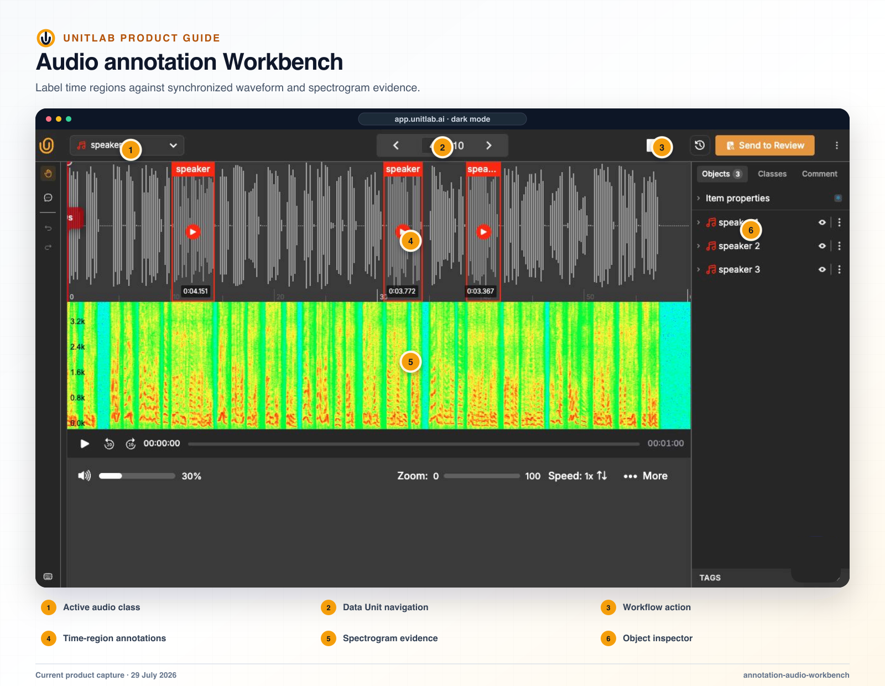


**Who this guide is for:** Audio annotators, reviewers, ontology designers, and quality leads. **You will:** Produce audio events, speakers, segments, or classifications with consistent temporal boundaries.


## Before you begin

- A Unitlab workspace and the role required for the operation.
- A representative pilot sample that includes normal and difficult cases.
- A named owner for the configuration, quality decision, or operational result.

## End-to-end flow

~~~mermaid
flowchart LR
  A["Policy"]
  B["Inspect signal"]
  C["Create region"]
  D["Refine boundary"]
  E["Review"]
  A --> B
  B --> C
  C --> D
  D --> E
~~~

## Procedure



### 1. Open the task and confirm the event, speaker, transcription, or classification policy


### 2. Choose waveform, spectrogram, playback speed, loop, zoom, and visibility settings


### 3. Select the class and create the time region or Item Property


### 4. Refine onset and offset using the agreed silence, overlap, clipping, and uncertainty rules


### 5. Complete required properties and relationships


### 6. Review at normal and reduced playback speed and compare spectrogram evidence when relevant


### 7. Save, confirm validation, and submit through the workflow



## Product behavior and controls

The audio workspace provides:

- waveform and timeline;
- temporal event segments;
- play/pause;
- rewind and forward by 10 seconds;
- current time and duration;
- volume and mute;
- zoom;
- playback speed;
- event/class selection;
- comments;
- item properties;
- tags;
- workflow completion actions.

The audio workbench combines waveform and spectrogram context with temporal event regions. Audio can also be aligned with document text or video inside the same grouped task.

## Common audio tasks

- **Clip classification:** describe the whole recording.
- **Temporal event detection:** mark the start and end of a sound, speaker, motion, noise, or other event.
- **Segmentation:** partition a recording into meaningful regions.
- **Transcription-oriented work:** produce or review speech text.

An external audio model can return an Event result and may optionally provide a speech-recognition transcript.

## Boundary quality

Audio disagreement often comes from boundary policy rather than class identity. Teams should define whether an event begins at the first acoustic evidence, the first intelligible phoneme, or a fixed context margin; how overlap is handled; whether silence is labeled; and how background noise interacts with foreground speech.

## Verify the result

- [ ] The visible result matches the project Instructions and active ontology.
- [ ] The workflow stage, assignee, and queue state are correct.
- [ ] A second user with the intended role can reproduce the result.
- [ ] Downstream dataset or release behavior remains correct.

## Failure modes and recovery

| Symptom | What to check |
|---|---|
| The expected action is unavailable | Check the active workflow stage, user role, selected item, and whether the required resource is Live or still processing. |
| The result appears incomplete | Inspect filters, source membership, Data Group membership, invalid state, and Batch Queue failures before repeating the operation. |
| A change affects existing work | Stop the rollout, identify affected items and versions, validate a recovery path on a sample, and document the change owner. |

## Operational record

For a material change, record the workspace, project, source or dataset version, ontology version, workflow stage, affected item or Batch Queue IDs, responsible owner, validation sample, result, and downstream release impact. Never include API keys, cloud credentials, signed download URLs, or regulated source data in tickets or logs.

## Product view

*Waveform and spectrogram context support precise temporal-region decisions and repeatable boundary review.*

