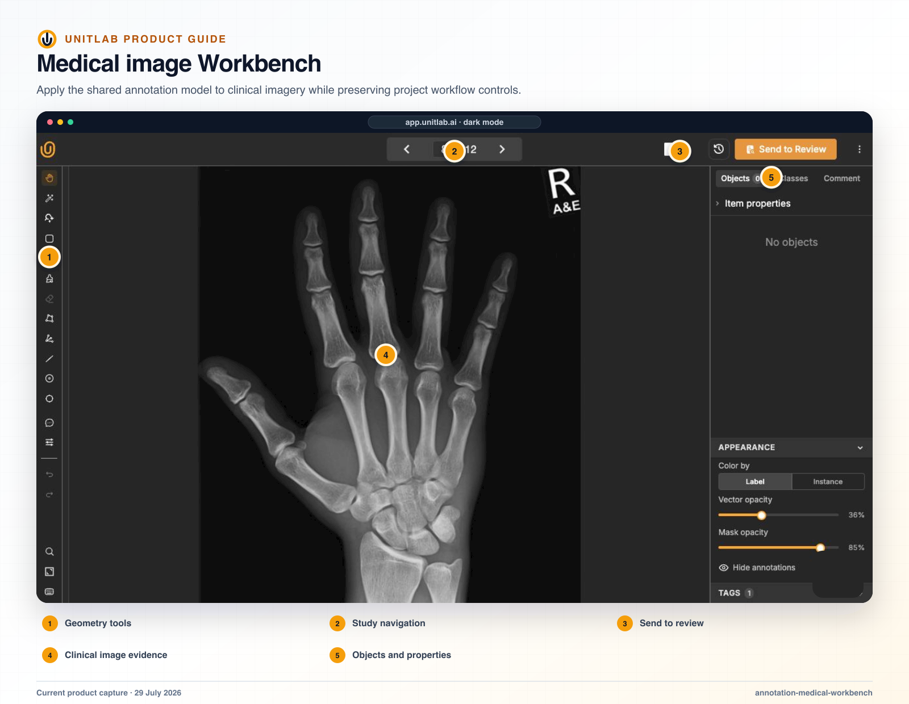
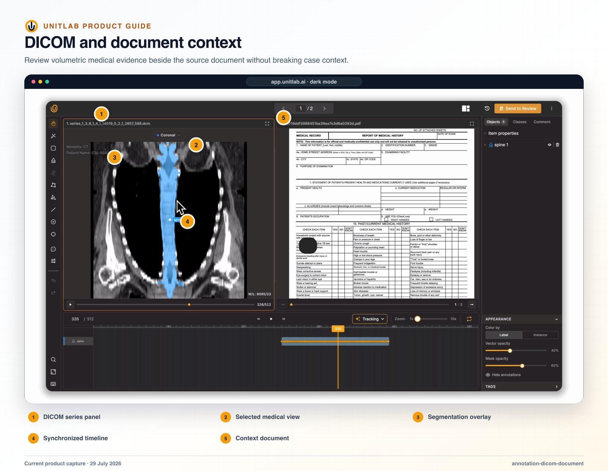


**Who this guide is for:** Clinical annotators, specialist reviewers, medical project managers, and solution architects. **You will:** Complete a medical work item with traceable view, geometry, ontology, and review context.


## Before you begin

- Approved access and data-handling controls for the source sensitivity and regulatory context.
- A processed DICOM, NIfTI, NRRD, or supported medical resource.
- A Live medical ontology and instructions written with specialist ownership.
- A configured medical layout for Axial, Sagittal, Coronal, 3D, projection, or contextual document views.

## End-to-end flow

~~~mermaid
flowchart LR
  A["Study"]
  B["Views + windowing"]
  C["Annotate"]
  D["Cross-plane review"]
  E["Specialist decision"]
  A --> B
  B --> C
  C --> D
  D --> E
~~~

## Procedure



### 1. Open the medical task and confirm study, series, orientation, and stage


### 2. Configure synchronized views, window/level or VOI LUT, projection, slab thickness, color map, threshold, and 3D opacity as required


### 3. Navigate slices without advancing to another project item


### 4. Create geometry or Item Properties from the active authoritative panel


### 5. Use passive panels and contextual documents for evidence while preserving one editing source


### 6. Review the annotation across planes and 3D context


### 7. Complete required ontology values, save, and route to specialist review



## Product behavior and controls

Medical is a resource family inside a typeless project. Medical resources open the native medical Workbench while remaining part of the same project, ontology, workflow, queue, and release system used by other modalities.

## Synchronized DICOM and 3D context

The medical workbench supports:

- axial view;
- sagittal view;
- coronal view;
- 3D view;
- synchronized annotations across views;
- window/level values visible per view;
- contextual document content beside medical imagery;
- multiview and multi-case layout switching.

The product story is not merely “four panes.” The key operational value is that an edit can remain connected across anatomical views, reducing the context switching required to reconcile separate representations of the same study.

## Medical ontology example

An example medical ontology can contain a `spine` mask class with structured properties such as:

- coverage: Cervical, Thoracic, Lumbar, Sacrum, Coccyx;
- a conditional Record property when Sacrum is selected;
- deeper text input when Normal is selected;
- Clinical Finding options including Normal, Degenerative changes, Compression fracture, Scoliosis, and Hardware present.

This shows how geometry, anatomy, and clinical meaning can be kept separate. A mask identifies the spatial region; properties capture structured findings; conditional branches request detail only when relevant.

## Medical formats and ingestion

The SDK supports mixed upload directories containing DICOM, NIfTI, and NRRD alongside common image and document formats. DICOM slices are grouped by `SeriesInstanceUID` into one user-facing medical volume. Internal source slices, pending rows, and failed rows do not appear as separate grid items, queue tasks, or navigation entries.

## Verify the result

- [ ] The visible result matches the project Instructions and active ontology.
- [ ] The workflow stage, assignee, and queue state are correct.
- [ ] A second user with the intended role can reproduce the result.
- [ ] Downstream dataset or release behavior remains correct.

## Failure modes and recovery

| Symptom | What to check |
|---|---|
| The expected action is unavailable | Check the active workflow stage, user role, selected item, and whether the required resource is Live or still processing. |
| The result appears incomplete | Inspect filters, source membership, Data Group membership, invalid state, and Batch Queue failures before repeating the operation. |
| A change affects existing work | Stop the rollout, identify affected items and versions, validate a recovery path on a sample, and document the change owner. |

## Operational record

For a material change, record the workspace, project, source or dataset version, ontology version, workflow stage, affected item or Batch Queue IDs, responsible owner, validation sample, result, and downstream release impact. Never include API keys, cloud credentials, signed download URLs, or regulated source data in tickets or logs.

## Product view

*The medical Workbench places synchronized study views, ontology controls, and specialist workflow state in one governed interface.*

*Medical layouts can preserve DICOM evidence alongside the contextual documentation required for a study-level decision.*

