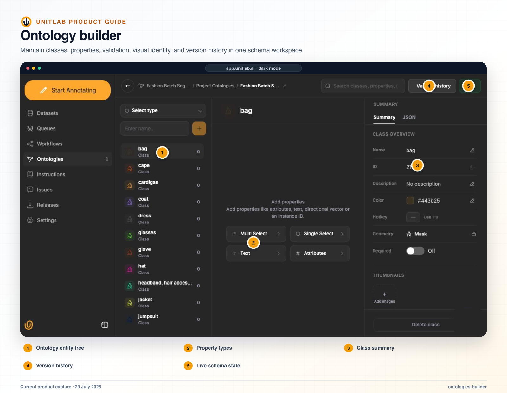


**Who this guide is for:** Ontology owners, quality leads, project managers, annotator trainers, and downstream data consumers. **You will:** Publish an ontology that encodes the same decisions as Instructions and remains interpretable through work and release history.


## Before you begin

- A Unitlab workspace and the role required for the operation.
- A representative pilot sample that includes normal and difficult cases.
- A named owner for the configuration, quality decision, or operational result.

## End-to-end flow

~~~mermaid
flowchart LR
  A["Policy"]
  B["Schema"]
  C["Logic"]
  D["Workbench test"]
  E["Publish"]
  A --> B
  B --> C
  C --> D
  D --> E
~~~

## Procedure



### 1. Define the labeling decision and downstream schema before creating classes


### 2. Create classes, annotation types, required state, descriptions, colors, hotkeys, and examples


### 3. Add typed properties, options, validation, relations, and Item Properties


### 4. Add conditional branches only where they change a meaningful decision


### 5. Inspect Summary, JSON, logic map, and every reachable conditional path


### 6. Test the ontology in the Workbench on representative items


### 7. Publish the draft and record the version


### 8. Treat every later Live change as a data-contract change and validate schema drift



## Product behavior and controls

## What an annotation ontology is

An ontology is the contract that turns domain language into repeatable labels. It defines what can be annotated, how it is represented, which properties are required, which options are allowed, and how labeled objects relate to each other.

Without a governed ontology, two annotators can produce geometrically valid but semantically incompatible data. A good ontology aligns:

- the observable evidence in the source data;
- the model output the team wants to train;
- the business or research decision the label will support;
- the review criteria used to accept the label.

## Supported structures

**Workbench ontology entities:**

- item properties: single-choice, multi-choice, text;
- spatial classes: bounding box, cuboid, polygon, mask, keypoint, line, skeleton;
- text entity;
- audio event;
- relation.

**SDK ontology structures:**

- shapes: bounding box, polygon, point, skeleton, polyline, bitmask, cuboid, time range, text;
- attributes: radio, checklist, text, numeric;
- whole-item/global classification;
- required attributes;
- dynamic attributes for values that can change across video keyframes;
- conditional attributes nested beneath selected options.

The UI and SDK use slightly different vocabulary for closely related concepts—for example Mask/bitmask, Event/time range, Entity/text, single-choice/radio, and multi-choice/checklist.

## Class configuration

A class can include:

- name;
- description;
- color;
- numeric hotkey;
- geometry;
- attributes/properties;
- single-select, multi-select, and text properties;
- relations.

Geometry is selected when the class is created and is read-only afterward. This prevents an existing class from silently changing from one annotation representation to another. The class summary shows the stable class ID, description, color, hotkey, geometry, required state, thumbnails, statistics, maximum property depth, logic map, and JSON export.

## Property types, data types, and validation

Class properties and item properties support:

- **Single choice** — one option, stored as an enum;
- **Multiple choice** — several options, stored as a multi-enum;
- **Text** — with scalar data types including string, number, boolean, date, datetime, URL, email, and object ID.

Properties can carry a default value, help text, required state, and one compact validation rule appropriate to the data type:

- string: length or regular expression;
- number: range or regular expression;
- date/datetime: range;
- URL, email, or object ID: regular expression;
- multiple choice: selection count.

Required is a separate toggle rather than another validation rule. Save-time validation is non-blocking: invalid values are preserved in history, clearly messaged, and surfaced through the Invalid status path for correction.

## Item Properties

Item Properties describe the datasource or work item as a whole. They are not attached to one bounding box, mask, entity, event, or other annotation object. They are appropriate for fields such as:

- image quality, capture condition, scene type, weather, or overall safety state;
- document category, language, completeness, or case outcome;
- audio channel quality, conversation outcome, or recording environment;
- video scene, camera state, traffic density, or activity phase;
- medical study quality, procedure phase, or case-level finding.

An Item Property can be **Single choice**, **Multiple choice**, or **Text**. It can be required, carry help text and a default value, use type-aware validation, and contain option-triggered nested properties with the same unlimited conditional depth available to class properties.

In the Workbench, **Item properties** appears at the top of the Objects inspector, above individual annotation objects. The user can set an Item Property without selecting an object. This placement keeps whole-item meaning separate from the properties of a specific object.

For image, text, audio, and document items, an Item Property normally applies to the complete item. For video and medical sequences, it can remain static across the item or be marked **Dynamic** so its value changes across frames. Dynamic Item Properties appear as their own timeline rows and are described in the video timeline section.

Item Properties follow the same ontology lifecycle as classes: they appear in the Ontology Builder, can be created from the annotation-side class manager, are versioned with the ontology, are preserved in annotation history, and are included in release/export structures that support them.

## Conditional properties and unlimited depth

Properties can be nested beneath a selected option, and the current builder can continue the pattern repeatedly without a fixed depth limit. The interface reports the current depth and exposes Add nested property at the selected option.

Example:

```text
Product
└── Product type
    ├── Box
    ├── Can
    └── Bottle
        └── Bottle material
            ├── Plastic
            └── Glass
                └── Glass color
                    ├── Clear
                    ├── Green
                    └── Brown
```

Unlimited depth is a capability, not a design target. Add another level only when the parent choice makes the child question relevant and the downstream consumer uses the distinction.

## Two ways to create ontology content

1. **From the Ontologies page** — the complete schema-design path. The user creates classes, Item Properties, relations, class properties/attributes, options, validation, and conditional nested branches in the three-column builder; reviews the Logic Map; publishes the draft; and makes the ontology Live for annotation.
2. **From the annotation Workbench** — the contextual path. The user can create a compatible class, open **Manage Classes**, add class properties/attributes, create Item Properties, define relations, or add a property/relation directly from the object inspector without leaving the item being labeled.

Both paths update the project’s active schema. The Ontologies page is designed for broad schema planning and version review; the Workbench path is designed for a missing field discovered in context while annotation is underway.

## Ontology lifecycle language

The ontology lifecycle uses these user-facing terms:

- **Live** — the one project ontology currently driving annotation;
- **Archived** — a read-only ontology;
- **Publish draft** — publish current unpublished edits;
- **Version history** — review visible published snapshots and semantic change events;
- **Restore as draft** — restore an older snapshot into unpublished changes;
- **Snapshot · Read only** — historical inspection mode.

Project ontology rows use the Live and Archived states. Internal work-in-progress rows are hidden from the project list and history; unpublished changes are managed through **Publish draft** inside the builder.

A project can contain several independent ontology copies but at most one Live ontology. Importing or duplicating creates an independent copy; later edits do not live-sync back to the source. **Make live** belongs in the Project Ontologies row actions. Making another ontology Live removes Live from the previous ontology without converting or deleting its schema.

## Project Ontologies list

The minimal list contains:

- Name;
- Classes;
- Properties;
- Relations;
- Updated;
- Actions.

Only **Live** and **Archived** appear as inline badges. Normal saved ontologies have no badge. Internal drafts are hidden. A never-published root ontology can appear without a badge.

## Unified builder UX

The builder is a three-column editing surface.

**Left — entity navigator**

- Mixed list of classes, item properties, and relations.
- Type icon, name, sublabel, and count per entity.
- Type dropdown grouped into item properties, visual geometries, text/audio types, and relation.
- Name input plus compact create action.

**Center — schema tree**

- Selected entity name, type, counts, required/default information, and menu.
- Single choice, multiple choice, text, and attribute actions when applicable.
- Draggable, collapsible property rows.
- Options rendered directly below expanded choice properties.
- Quiet inline **+ Add option** row; Enter creates and Escape cancels.
- Nested branches displayed below the option that triggers them.
- Relations remain definition-only and do not show property-authoring controls.

**Right — inspector**

- With no property selected: Summary and JSON tabs.
- With a property selected: Selected Property metadata and validation.
- With an option selected: compact controls to add a nested Single choice, Multi choice, or Text property beneath that option.
- Entity delete action in the sticky footer with type-specific wording.

Routine tree edits save quietly without reloading the full builder or showing a generic success toast.

## Builder header and version history

Header states are intentionally simple:

- clean Live ontology: **Version history** + **Live**;
- unpublished changes: **Version history** + **Publish draft**;
- archived ontology: **Version history** + **Archived**;
- historical snapshot: **Version history** + **Snapshot · Read only**;
- clean non-Live ontology: **Version history** only.

The Version history modal is the only history surface. It shows immutable visible versions, inline semantic events, search, pagination, **View snapshot**, and **Restore as draft**. Restoring creates unpublished changes; it does not immediately publish or make the ontology Live. Snapshot and Archived modes disable every mutation but keep search, JSON export, history, and logic-map inspection available.

## Logic map

The read-only logic map visualizes:

```text
Class or item property → Property → Option → Condition → Nested property
```

Options are first-class nodes because they own conditional branches. Large maps progressively disclose deeper branches. Users can expand branches and zoom without existing nodes jumping, resizing, or recentering. Relations are excluded from the logic map because they are definition-only entities in the current builder.

## Annotation-side ontology UX

Annotation-side schema tools keep the user inside the labeling context while providing several ways to extend the Live ontology.

**Quick Create Class**

- Opens when the selected annotation tool requires a compatible class and none exists.
- Contains geometry/type, class name, color, numeric hotkey, Create, Cancel, and Close.
- Creating the class selects it, keeps the chosen drawing tool active, and lets annotation continue immediately.
- If the project has no ontology, the first Quick Create Class creates `<Project Name>'s ontology`, makes it Live, and adds the class.
- Hotkeys accept `1` through `9`; duplicate assignments produce inline validation.

**Manage Classes**

1. Open **Manage Classes** from an explicit class-management entry point.
2. Use **Select type**, **Search or Create**, and **+ Add** to find or add an entity appropriate to the active resource.
3. For a class, edit its name, color, description, required state, and hotkey. Its geometry remains the type selected at creation.
4. Use the same manager to create or manage lightweight Item Property and relation definitions.
5. Choose **Manage Ontologies** to open the complete Live ontology builder in a new tab without discarding the active annotation task.

Annotation-side type choices follow the opened resource: text offers **Entity**, audio offers **Event**, and visual resources offer compatible visual geometries. Item Properties and relations are available across data families. The full Ontology Builder remains schema-wide.

**Add a property or attribute from an annotation object**

1. Select an annotation in the canvas or Objects list.
2. Expand the object in the inspector and choose **+ Add property**. A nested **Add property** action is also available from a selected choice option when the new question must be conditional.
3. Enter the property name and optional description.
4. Set **Required** when every completed annotation must provide a valid value. Enable **Dynamic** for a frame-aware value in video or medical annotation.
5. Choose **Single-choice**, **Multi-choice**, or **Text**.
6. For a choice property, enter options, add more with **+ Add option**, reorder them by dragging, or remove an option. Text properties do not display the options editor.
7. Select **Add property**. The new field appears under the selected object—or beneath the selected option for a conditional branch—without changing the current object selection.

**Add or apply class attributes from the annotation object**

1. Select the annotation and choose **Add attributes** in its inspector.
2. Search the class’s existing attributes and toggle one or more values for this annotation.
3. If the typed name does not already exist, choose **Create “<attribute name>”** to add the class attribute in context.
4. Close the popover. The active attribute names appear on the object row and are saved with that annotation.

Attributes act as lightweight class-defined tags on an annotation. Properties provide typed, validated, and optionally conditional fields. Both can be shown or hidden during project-level visual QA.

**Add or update a relation from the annotation object**

1. Select the source annotation and choose **+ Add relation**.
2. In **Add Relation**, enter the relation name and optional description, then select the target annotation or annotations.
3. Save to display the relation in the object’s compact relation list.
4. Select an existing relation to open **Update Relation** with its name, description, and targets prefilled.

Relations connect annotation objects; they do not become ordinary object properties. The same definition appears in the Ontology Builder’s relation list.

**Add an Item Property during annotation**

1. Expand **Item properties** at the top of the Objects inspector.
2. If no definition exists, choose **Add item properties**. To create a conditional child, choose **Add item property** beneath the parent option that should reveal it. Item Property definitions can also be managed through **Manage Classes**.
3. Enter its name, optional description, required/dynamic state, type, and choice options where applicable.
4. Select **Add property**. The definition appears under **Item properties** and in the full Ontology Builder.
5. Set its value for the complete item or, when Dynamic is enabled for a sequence, set frame-aware values on its timeline row.

Annotation-side additions never mutate an archived ontology or a read-only historical snapshot. They extend the current project’s Live ontology and remain available for centralized review and later publication.

Ontologies can also be listed, filtered, retrieved, created from a programmatic structure, edited, and saved.

## Schema-drift protection

When annotations referenced ontology items that had been removed, Unitlab displayed a Restore deleted items dialog. The user could keep the items deleted, restore selected items, or stop showing the warning.

This is useful protection, but it does not replace migration design. Before changing a live ontology, determine whether the change is additive, a rename, a merge, a split, a semantic redefinition, or a retirement. Preserve historical releases and validate downstream parsers before publishing the new schema.

## Verify the result

- [ ] The visible result matches the project Instructions and active ontology.
- [ ] The workflow stage, assignee, and queue state are correct.
- [ ] A second user with the intended role can reproduce the result.
- [ ] Downstream dataset or release behavior remains correct.

## Failure modes and recovery

| Symptom | What to check |
|---|---|
| The expected action is unavailable | Check the active workflow stage, user role, selected item, and whether the required resource is Live or still processing. |
| The result appears incomplete | Inspect filters, source membership, Data Group membership, invalid state, and Batch Queue failures before repeating the operation. |
| A change affects existing work | Stop the rollout, identify affected items and versions, validate a recovery path on a sample, and document the change owner. |

## Operational record

For a material change, record the workspace, project, source or dataset version, ontology version, workflow stage, affected item or Batch Queue IDs, responsible owner, validation sample, result, and downstream release impact. Never include API keys, cloud credentials, signed download URLs, or regulated source data in tickets or logs.

## Product view



*The ontology builder is the versioned semantic contract for classes, geometry, properties, relations, and item-level values.*

