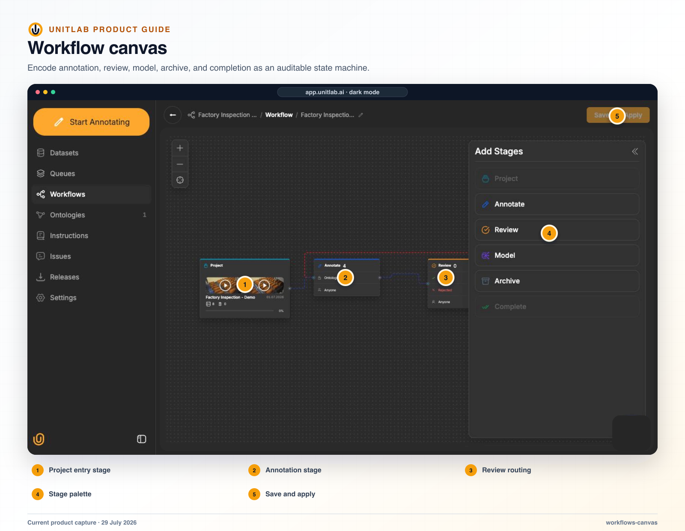


**Who this guide is for:** Project managers, operations leads, reviewers, and SDK integrators. **You will:** Create an explicit operating system for human and model work where every state and transition has an owner.


## Before you begin

- A Unitlab workspace and the role required for the operation.
- A representative pilot sample that includes normal and difficult cases.
- A named owner for the configuration, quality decision, or operational result.

## End-to-end flow

~~~mermaid
flowchart LR
  A["Project"]
  B["Annotate or Model"]
  C["Review"]
  D["Rework or specialist"]
  E["Complete"]
  A --> B
  B --> C
  C --> D
  D --> E
~~~

## Procedure



### 1. Write the normal, rejected, invalid, failed, skipped, and escalated operating paths


### 2. Add Project, Annotate, Review, optional Model, Archive, and Complete stages


### 3. Connect accepted and rejected routes and name every human owner


### 4. Save and apply the workflow to a pilot project


### 5. Inspect created Task Queue and Batch Queue state, priority, assignment, and availability


### 6. Exercise every stage action in the Workbench


### 7. Use filters and bulk operations only on reviewed target sets


### 8. Record change impact before editing a live workflow



## Product behavior and controls

## Workflow canvas

A new project receives the default workflow:

```text
Project → Annotate → Review → Complete
```

The six stage types currently released in the editor are:

- **Project** — the single entry point;
- **Annotate** — human labeling;
- **Review** — human quality review with approve and reject routes;
- **Model** — automated inference on entry;
- **Archive** — terminal set-aside state;
- **Complete** — terminal successful state and release-readiness destination.

The released stage catalog contains Project, Annotate, Review, Model, Archive, and Complete. A team that needs specialist or expert review adds and names another Review stage, then configures its eligible reviewers and routing rules.

The canvas supports:

- adding stages;
- drawing connections;
- naming the workflow;
- binding the reusable workflow to a project;
- configuring eligible annotators or reviewers per human stage;
- allowing or preventing self-assignment;
- allowing manager override;
- hiding unassigned work where required;
- configuring whether the stage can be skipped;
- selecting a model, thresholds, generic type, queue scope, and class mappings for Model stages;
- accepted and rejected review branches;
- Save and Apply with impact validation;
- zoom, reset, and canvas navigation.

The workspace Workflows page displays reusable workflow cards and a Create Workflow action. Opening a project’s Workflows tab goes directly to the editor for that project’s active workflow.

In the full-page editor, users drag released stages from **Add Stages** onto the canvas, connect or remove edges, select a node to edit its configuration, and use one explicit **Save & Apply** action. The Project entry node embeds project progress. Stage names are editable except Project; duplicate display names are numbered consistently in both the canvas and Task Queue.

Replacing an active project workflow while items are in flight prompts with the number of items that would reset to Project. An unsaved-changes guard protects navigation away from the editor. Workflows can also be duplicated, archived, and restored.

## Rejection is a route, not a failure state

Review has both approve and reject edges. This allows a correction path to be designed before production starts.

A production workflow might be:

```text
Project
├── Model → Annotate → Review
│                    ├── Accepted → Complete
│                    └── Rejected → Annotate
└── Difficult/low-confidence → Specialist Review
                               ├── Accepted → Complete
                               └── Rejected → Annotate
```

Here, Specialist Review is another stage of the released **Review** type with a specialist eligibility list, not a different stage type.

## Human review

Review stages require Approve and Reject outcomes. Approve follows the forward edge; Reject returns the item to the configured rework stage and can generate a rework notification. Workbench actions come from the item’s current stage rather than a fixed button set. Review should test the task’s quality policy, not merely confirm that an annotation exists.

## Workbench stage actions

Saving and moving through the workflow are separate actions. Saving appends annotation history inside the current stage. A stage action changes the item’s route.

The Workbench header builds available actions from the current item and can show:

- **Send to Review** or **Send to `<stage>`**;
- **Mark as Complete**;
- **Reject** as a danger action;
- **Restart Workflow** for a manager viewing a Complete item;
- item timeline.

Automated-stage items open read-only while the model or automation owns them. After a successful stage action, Unitlab saves dirty work, advances to the next item in the current queue/filter context, and returns to the project Datasets page with a Queue complete message when no work remains.

## Model-in-the-loop patterns

- **Model → Annotate → Review:** a model proposes labels, an annotator corrects them, and a reviewer verifies the result.
- **Annotate with local assistance → Review:** Magic Touch, prompt detection, Find Similar, or tracking helps the annotator within the task.
- **Model → Review with rejection to annotation:** high-confidence output moves directly to review; rejected work returns to a human correction stage.
- **Annotate → Review → specialist Review:** ambiguous or high-risk cases move to a second Review stage configured for specialists.

## Workflow save and change impact

Workflows are reusable workspace definitions that can be bound to multiple projects. Saving an active graph is therefore not a cosmetic edit. Before applying a change, Unitlab validates reachability, required edges, terminal stages, and the effect on in-flight items.

Important UX rules:

- exactly one Project and one Complete stage;
- Project has no incoming edge and must lead to an entry stage;
- Review has one Approve and one Reject route;
- terminal stages have no outgoing routes;
- every stage is reachable from Project;
- duplicate outgoing action names are rejected;
- a stage holding active items cannot be silently deleted;
- sensitive automated-stage configuration cannot change while occupied without resolving the impact.

When an active workflow change would strand work, Unitlab returns an apply-impact conflict instead of silently moving or losing items.

## Model-stage user experience

Entering a Model stage automatically dispatches the configured model. The item shows Processing while inference runs. Predictions are saved as normal annotation history, then the item follows the Model stage’s default edge to another Model stage, Annotate, Review, or a terminal stage. A failure moves the item to Error so it can be diagnosed rather than disappearing from the workflow.

## Workflow automation through the SDK

A project workflow exposes stages and tasks. Automation can:

- list stages;
- find a stage by name or ID;
- list stage tasks;
- claim a task;
- assign or release a task;
- set priority;
- submit annotation work;
- approve or reject review work;
- include a rejection reason and comment;
- skip a task;
- move a task directly to another stage;
- read its timeline;
- bulk-assign or bulk-move tasks.

This is a meaningful enterprise capability: assignment, routing, and audit do not have to remain a manual browser-only process.


## 17. Queues and work allocation

The project Queue page has two URL-persisted tabs with different purposes:

| Queue | Default? | Unit represented | Primary action |
|---|---|---|---|
| **Task Queue** | Yes | One workflow work item waiting in a stage | Manage Workflow / open work |
| **Batch Queue** | No | One upload or import action | Upload data / inspect ingestion |

## Task Queue UX

The Task Queue is a two-pane operational surface.

**Stage rail**

- one row per visible stage in the bound workflow;
- tinted stage-type icon and stage name;
- copyable stage identifier;
- live item count;
- selected stage persisted in the URL.

The Project entry stage is not shown as a work queue even though it anchors routing.

**Task table**

- select checkbox;
- inline numeric Priority editor for managers;
- media thumbnail and short task ID;
- derived Status;
- Assigned to;
- Actions.

The default order is highest priority first. The explicit row action is **Open**, which launches the correct native editor in the Workbench while preserving queue scope. Assign and Release live in the Assigned-to dropdown. Moving work between stages is a bulk action, not a casual per-row shortcut.

When one or more tasks are selected, the bulk action bar offers Priority, Move, Unassign, and Assign. Bulk Move first calculates a plan and asks for confirmation.

Data Groups appear as one mixed work item with group name, tile count, aggregate status, assignee, and priority. Their member tiles do not appear as duplicate tasks.

Manager/admin users can view and manage all stage queues according to permission. Member-family users see only stages for which their annotator/reviewer position is eligible and only work that is assigned, claimable, or intentionally visible as unassigned.

Task queues answer operational questions:

- What work is waiting at each stage?
- Which tasks are unassigned?
- Who owns the oldest or highest-priority items?
- Which modality or dataset is causing a backlog?
- How much work was rejected back to annotation?

## Batch Queue UX

Each Batch Queue row represents one upload/import action and shows:

- cover thumbnail or type fallback;
- name and import date;
- data-type chips;
- item count;
- progress bar;
- queue status;
- assignee avatars aggregated from the imported items;
- running automation summary where applicable.

Search matches queue name and metadata. Filters include queue status, assignee, and one or more data types; selecting several types uses OR behavior. Opening a row shows the project data grid scoped to that upload session. Uploading again from inside this detail view reuses the same Batch Queue; uploading from the top-level project page creates a new queue.

The SDK exposes total, completed, processing, and failed counts plus item-level data. A queue can be finished processing and still contain failures, so operators should inspect both the overall state and individual rows.

## Assignment strategy

Unitlab supports direct assignment and “Anyone” availability. A mature operating model combines:

- pooled work for routine tasks;
- direct assignment for accountable ownership;
- expert routing for difficult cases;
- priority values for urgent or high-value units;
- reviewer independence where the risk justifies it.

Assignment belongs to the workflow item state. Workspace role determines broad authority; project position and stage configuration determine whether a user can work as an annotator or reviewer in that queue.

## Verify the result

- [ ] The visible result matches the project Instructions and active ontology.
- [ ] The workflow stage, assignee, and queue state are correct.
- [ ] A second user with the intended role can reproduce the result.
- [ ] Downstream dataset or release behavior remains correct.

## Failure modes and recovery

| Symptom | What to check |
|---|---|
| The expected action is unavailable | Check the active workflow stage, user role, selected item, and whether the required resource is Live or still processing. |
| The result appears incomplete | Inspect filters, source membership, Data Group membership, invalid state, and Batch Queue failures before repeating the operation. |
| A change affects existing work | Stop the rollout, identify affected items and versions, validate a recovery path on a sample, and document the change owner. |

## Operational record

For a material change, record the workspace, project, source or dataset version, ontology version, workflow stage, affected item or Batch Queue IDs, responsible owner, validation sample, result, and downstream release impact. Never include API keys, cloud credentials, signed download URLs, or regulated source data in tickets or logs.

## Product view



*The workflow canvas makes stage transitions, human and model responsibility, and exceptional routes explicit.*


*Task queues expose actionable work with stage, ownership, status, and item context for daily operations.*

