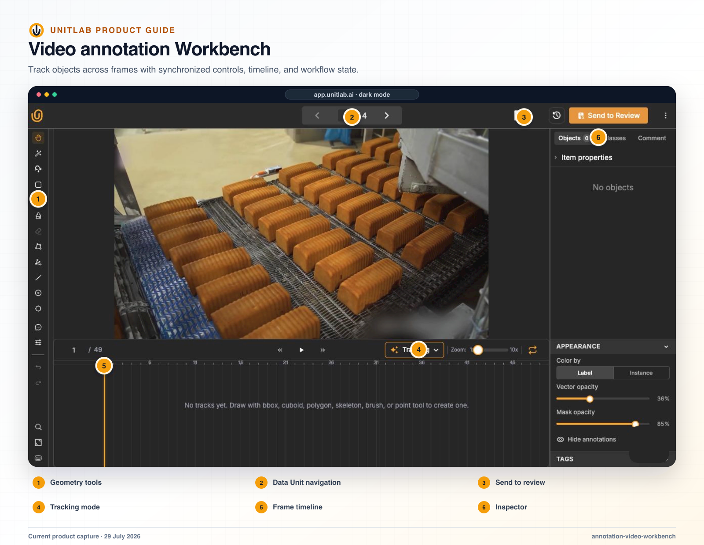


**Who this guide is for:** Video annotators, reviewers, and ML operations. **You will:** Choose and operate the correct temporal propagation method and recover safely from model or interpolation errors.


## Before you begin

- A Unitlab workspace and the role required for the operation.
- A representative pilot sample that includes normal and difficult cases.
- A named owner for the configuration, quality decision, or operational result.

## End-to-end flow

~~~mermaid
flowchart LR
  A["Seed"]
  B["Method"]
  C["Run"]
  D["Timeline inspection"]
  E["Correction"]
  A --> B
  B --> C
  C --> D
  D --> E
~~~

## Procedure



### 1. Select a reliable object or multi-object seed on the current frame


### 2. Choose Track full annotation, Track forward, or Track backward based on the available range


### 3. Monitor the active tracking operation and stop it if identity or geometry diverges


### 4. For interpolation, place deliberate source keyframes around meaningful motion changes


### 5. Apply dynamic object and Item Properties to their exact ranges


### 6. Use timeline zoom, row selection, handles, contextual actions, and hidden ranges to inspect the result


### 7. For masks, interpolate only between suitable manual mask keyframes


### 8. Clear, correct, or rerun generated spans while preserving authoritative keyframes



## Product behavior and controls

Auto-Tracking uses machine learning to predict an object across frames. The user starts with one or more annotated objects, chooses a tracking direction, runs tracking, then reviews the propagated results and keyframes on the timeline.

Use Auto-Tracking when motion is continuous enough for model proposals to reduce repeated drawing. Review after occlusion, re-entry, camera cuts, scale changes, blur, and interactions between similar objects.

## Full, forward, and backward tracking

Right-clicking a supported object opens **Auto track** with three directional actions:

| Action | Range | Typical use |
|---|---|---|
| **Track full annotation** | Runs in both directions from the selected frame across the annotation’s available temporal range | The seed object is created in the middle of a sequence and the complete track is required |
| **Track forward** | Runs from the selected frame toward later frames | The first reliable appearance of the object is known, or only future motion needs propagation |
| **Track backward** | Runs from the selected frame toward earlier frames | The clearest object appearance occurs later and earlier frames need to be recovered |

Direction availability follows the current position. **Track backward** is unavailable at the first frame, and **Track forward** is unavailable when no later frame remains. Full tracking provides bidirectional propagation from a single reliable seed.

The same commands are available from a selected timeline segment. While a track is running, the segment menu changes from **Tracking** to **Stop Tracking**, allowing the user to end an active tracking operation.

## Multi-object tracking

Unitlab can track several objects in one operation:

1. The annotator holds **Command** on macOS or **Ctrl** on Windows/Linux and right-clicks objects to build a multi-selection.
2. The context menu reports the number of selected objects.
3. The annotator chooses **Auto track**.
4. The annotator selects **Track full annotation**, **Track forward**, or **Track backward**.
5. Unitlab submits the selected supported tracks together and writes each result back to its own object track.
6. The annotator reviews every result on the timeline and corrects individual tracks where identities diverge.

The multi-object menu also provides group actions such as bring all to front, send all to back, duplicate all, and delete all. Group tracking preserves separate object identities; it does not merge the selected objects into one annotation.

## Interpolation

The live control describes Interpolation as “Tween between keyframes.” It is deterministic propagation between manually defined states and is appropriate when an annotator can place reliable keyframes around smooth motion.

## Auto-Tracking versus interpolation

| Question | Auto-Tracking | Interpolation |
|---|---|---|
| Source of intermediate labels | Model predictions | Geometry between keyframes |
| Best fit | Complex but trackable motion | Smooth movement between known states |
| Main risk | Identity drift or confident false proposals | Missing non-linear motion or shape change |
| Review focus | Track identity, occlusion, re-entry, false positives | Keyframe placement and motion between keys |

## Dynamic properties

Class properties can be marked **Dynamic** in video and medical annotation. This enables temporal labeling across frames: a dynamic property stores frame-aware values instead of one value for the complete object track. For example, a person can remain the same tracked instance while `Helmet status` changes from `Not visible` to `Present` and later to `Absent`.

Dynamic class-property flow:

1. Create or edit the property and enable **Dynamic**.
2. Select the annotated object at the frame where the value becomes known or changes.
3. Set the single-choice, multi-choice, or text value in the object inspector.
4. Unitlab creates a property keyframe for that object and displays the property as a child row beneath the object track.
5. Move to a later frame and change the value to create another temporal state.
6. Expand the object row on the timeline to inspect the property ranges and their transition points.

A non-dynamic class property applies to the object without a frame-by-frame value history. Dynamic properties are used when the object identity remains stable but its state changes across the sequence.

## Dynamic Item Properties

Item Properties describe the complete datasource rather than one annotation object. They can also be marked **Dynamic** for video and medical work, enabling temporal labeling across frames for whole-scene or whole-frame state—for example `Weather`, `Camera state`, `Scene`, `Traffic density`, `Procedure phase`, or `Overall quality`.

Dynamic Item Property flow:

1. Open **Item properties** at the top of the Objects inspector.
2. Add or select an Item Property whose **Dynamic** setting is enabled.
3. Set the value at the current frame. The first value creates an item-property range from that frame across the available sequence.
4. Move to another frame and set a different value. Unitlab creates a new keyframe and divides the timeline into value ranges.
5. Expand nested Item Properties to inspect conditional child values beneath the parent range.
6. Select a range on the timeline to jump to it, inspect its label/color, and adjust the temporal boundaries when required.

Static Item Properties appear as one full-item range. Dynamic Item Properties appear as independent timeline rows and are not attached to one object track. Class properties and Item Properties can both use nested conditional logic; their timeline placement distinguishes object state from item-level scene state.

## Timeline UX and user flow

The video and medical timeline is the temporal control center for geometry, object state, and item-level state.

**Timeline structure**

- The header shows the editable current-frame number, total frames, previous/play/next controls, the Tracking settings menu, timeline zoom from 1× to 10×, and loop control.
- The left column lists tracks by class and geometry. Bounding boxes, cuboids, polygons, masks/brushes, skeletons, points, polylines, instances, Item Properties, and dynamic annotation properties can have timeline rows.
- Parent object and Item Property rows can be expanded to reveal nested dynamic-property rows.
- Colored bars show active ranges. Diamond markers show keyframes. Explicit interpolation spans are connected visually between their source keyframes.
- The vertical playhead and numbered badge identify the active frame.

**Navigation and selection**

1. Enter a frame number, use previous/play/next, press **←/→**, click the timeline, or drag the numbered playhead to move through the sequence.
2. Click a track label or bar to select the corresponding annotation. The canvas and object inspector synchronize to that selection.
3. Enable **Auto zoom on timeline click** in View Settings to center the selected annotation automatically.
4. Use the 1×–10× timeline zoom and horizontal scrolling to inspect dense keyframes; vertical scrolling keeps the track-label column synchronized with the rows.

**Range editing and contextual actions**

- Drag a segment’s left or right handle to change where the annotation or property range begins or ends.
- Right-click a geometry segment to start/stop Tracking, hide/show the segment, delete it, or access mask interpolation when applicable.
- Hidden ranges remain part of the annotation history but are not rendered in their hidden interval.
- Selecting an object on the canvas selects its timeline row; selecting its timeline row selects the object on the canvas.
- Read-only release and passive Multiview panels show timeline context without exposing mutation actions.

**Tracking settings**

The **Tracking** menu contains two independent switches:

- **Auto-Tracking — Predict later frames with ML:** new supported annotations can immediately start model-assisted propagation.
- **Interpolation — Tween between keyframes:** geometry is generated between manually defined keyframes.

These settings can be used separately. Auto-Tracking follows visual evidence; interpolation follows the geometry defined at its surrounding keyframes.

## Mask interpolation

Video mask interpolation is distinct from general object interpolation. The user places or edits segmentation keyframes, then uses the **Interpolate mask** timeline action to materialize intermediate masks between them. Generated in-between masks remain reviewable. This is most useful for smooth boundary motion and still needs correction around occlusion, topology changes, rapid deformation, and scene cuts.

When a mask segment contains at least two manually created keyframes, its context menu exposes **Interpolate mask**. After intermediate masks are materialized, **Clear interpolation** removes the generated in-between frames while preserving the source keyframes.

## Verify the result

- [ ] The visible result matches the project Instructions and active ontology.
- [ ] The workflow stage, assignee, and queue state are correct.
- [ ] A second user with the intended role can reproduce the result.
- [ ] Downstream dataset or release behavior remains correct.

## Failure modes and recovery

| Symptom | What to check |
|---|---|
| The expected action is unavailable | Check the active workflow stage, user role, selected item, and whether the required resource is Live or still processing. |
| The result appears incomplete | Inspect filters, source membership, Data Group membership, invalid state, and Batch Queue failures before repeating the operation. |
| A change affects existing work | Stop the rollout, identify affected items and versions, validate a recovery path on a sample, and document the change owner. |

## Operational record

For a material change, record the workspace, project, source or dataset version, ontology version, workflow stage, affected item or Batch Queue IDs, responsible owner, validation sample, result, and downstream release impact. Never include API keys, cloud credentials, signed download URLs, or regulated source data in tickets or logs.

## Product view

*Tracking and interpolation are reviewed against the same frame-aware timeline used to create and correct temporal objects.*

