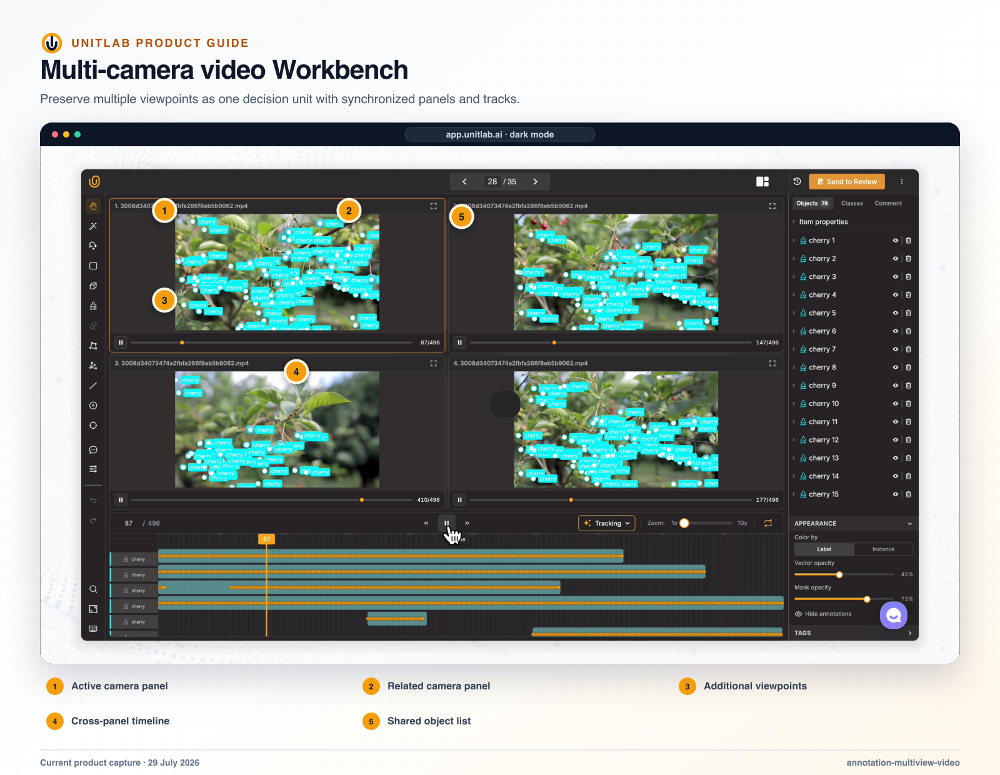


**Who this guide is for:** Annotators, reviewers, medical specialists, and solution architects. **You will:** Compare context across views or files without editing the wrong panel or confusing panel, media, and work-item navigation.


## Before you begin

- A Unitlab workspace and the role required for the operation.
- A representative pilot sample that includes normal and difficult cases.
- A named owner for the configuration, quality decision, or operational result.

## End-to-end flow

~~~mermaid
flowchart LR
  A["Open Data Unit"]
  B["Choose mode"]
  C["Configure panels"]
  D["Edit active panel"]
  E["Navigate safely"]
  A --> B
  B --> C
  C --> D
  D --> E
~~~

## Procedure



### 1. Open a work item and choose Current file or Multiple files


### 2. Select a layout from 1×1 through 4×4 and resize panels


### 3. Identify the active editable panel and passive inspection panels


### 4. Set the required page, frame, slice, zoom, or view in each panel


### 5. Activate another panel only after confirming its identity and saved state


### 6. Use top-center navigation for work items and within-item controls for frames, pages, time, or slices


### 7. For Data Groups, verify the fixed layout and group-level workflow state



## Product behavior and controls

Multiview is the default project annotation experience for all six data families. It is a persistent workspace containing the project header, work-item navigation, mode/layout selector, resizable panel grid, one active editor, and one or more passive inspection panels.

## Two modes

| Mode | What the panels show | Editing model | Default layout |
|---|---|---|---|
| **Current file** | Multiple views of the same datasource | One active editor; sibling panels mirror its changes in real time | 1×1 |
| **Multiple files** | Neighboring work items from the current queue/filter scope | One selected panel is editable; other items remain passive previews | 1×3 |

Layouts range from 1×1 to 4×4. Users can resize panel boundaries, fullscreen a panel, and switch modes from the Workbench header. Mode, layout, and panel sizes persist for the user.

## Active and passive panels

Only the active panel can mutate annotations. It receives the full native editor: tools, hotkeys, selection, object/event/entity editing, player or page controls, comments, classes, properties, history, and workflow actions.

Passive panels can show media, annotations, labels, pages, frames, waveforms, text, or medical projections. In Current file mode they receive the active panel’s live annotation changes, but they cannot originate edits, change the active selection, save, control playback, change a PDF page, edit text entities, or alter waveform regions.

When the user activates a passive panel:

1. Unitlab visually selects it immediately.
2. Any in-progress save in the outgoing panel is allowed to settle.
3. Unsaved changes are saved or safely snapshotted.
4. The outgoing panel becomes passive and pauses modality-specific playback.
5. The incoming native editor loads and restores its panel state.
6. The route updates only after the editor is ready.
7. If hydration fails, Unitlab restores the previous active panel instead of blanking the workspace.

## Current file flow

1. The user opens a work item from a dataset, Task Queue, Batch Queue detail, filtered grid, or direct link.
2. Unitlab creates multiple panel sessions for the same datasource without duplicating data or history.
3. One panel is active; the rest are read-only siblings.
4. Active edits are broadcast to siblings in real time.
5. The user can activate another panel to work from a different view, frame, page, or zoom state.
6. Saving refreshes the shared history and updates every sibling to the persisted result.

Current-file examples:

- **Image:** compare the same image at different zoom or inspection states.
- **Video:** inspect different frames of the same video while sharing annotations and downloaded frames.
- **Audio:** inspect different time regions while one waveform editor remains authoritative.
- **Text:** compare different windows of the same text while entity/relation changes remain synchronized.
- **Document:** compare different PDF pages without confusing page changes with work-item navigation.
- **Medical:** assign Axial, Sagittal, Coronal, and 3D views to separate slots with synchronized annotation state.

## Multiple files flow

1. The user selects **Multiple files** and a layout.
2. Unitlab fills the grid with the active item and neighboring items from the current visible set.
3. The visible set preserves queue, upload-session, archive, search, status, class, and assignment filters.
4. The user activates any ready panel.
5. If the item belongs to another data family, the correct editor loads within the same Workbench shell.
6. Previous/next navigation continues through the filtered work-item sequence.
7. Empty tail slots and inaccessible items appear as panel-level states rather than replacing the whole page with an error.

This mode supports mixed review—for example an image, video, PDF, and audio item in one 2×2 layout—while guaranteeing that only the selected panel is editable.

## Navigation hierarchy

Unitlab maintains three distinct navigation levels:

- **Top-center previous/next:** changes the project work item and can cross data families or move between loose items and Data Groups.
- **Panel activation:** changes which visible panel is editable without leaving the Workbench.
- **Within-item media navigation:** changes a video frame, audio time region, text window, medical slice/view, or PDF page inside the current work item.

Keeping these levels separate is essential for predictable UX. A PDF page change must never advance to another datasource, and a medical slice change must never appear as another project item.

## Grouped Workbench

A Data Group opens as one grouped Workbench whose layout is fixed by the Auto-Grouping builder. The header shows the group layout rather than the general mode/layout selector. Activating a tile never tears down the group route.

The project’s unified previous/next sequence treats each group as one work unit and excludes its member tiles from the loose-item sequence. Grouped saves remain attributable to the group.

## Verify the result

- [ ] The visible result matches the project Instructions and active ontology.
- [ ] The workflow stage, assignee, and queue state are correct.
- [ ] A second user with the intended role can reproduce the result.
- [ ] Downstream dataset or release behavior remains correct.

## Failure modes and recovery

| Symptom | What to check |
|---|---|
| The expected action is unavailable | Check the active workflow stage, user role, selected item, and whether the required resource is Live or still processing. |
| The result appears incomplete | Inspect filters, source membership, Data Group membership, invalid state, and Batch Queue failures before repeating the operation. |
| A change affects existing work | Stop the rollout, identify affected items and versions, validate a recovery path on a sample, and document the change owner. |

## Operational record

For a material change, record the workspace, project, source or dataset version, ontology version, workflow stage, affected item or Batch Queue IDs, responsible owner, validation sample, result, and downstream release impact. Never include API keys, cloud credentials, signed download URLs, or regulated source data in tickets or logs.

## Product view

*The Grouped Workbench keeps related views visible while preserving one authoritative active editor.*

