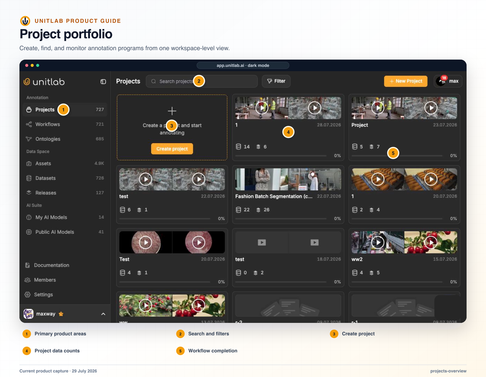


**Who this guide is for:** Project managers, quality leads, and solution architects. **You will:** Configure a typeless multimodal project whose work, policy, routing, and ownership are ready for a pilot.


## Before you begin

- A Unitlab workspace and the role required for the operation.
- A representative pilot sample that includes normal and difficult cases.
- A named owner for the configuration, quality decision, or operational result.

## End-to-end flow

~~~mermaid
flowchart LR
  A["Project"]
  B["Instructions + ontology"]
  C["Data"]
  D["Workflow + queues"]
  E["Pilot"]
  A --> B
  B --> C
  C --> D
  D --> E
~~~

## Procedure



### 1. Create the project with a meaningful program name


### 2. Write the task purpose and acceptance policy in Instructions


### 3. Build and publish the ontology


### 4. Attach the representative dataset version or project upload


### 5. Build and validate the workflow and queue ownership


### 6. Open representative Data Units in each native or grouped Workbench


### 7. Assign the calibration batch and verify stage actions


### 8. Review Statistics, Issues, and Releases after the pilot



## Product behavior and controls

## Projects are typeless

A project is a container for annotation work, not a single-modality project type. New project creation asks for a name only. The creation modal may display informational chips for Image, Video, Audio, Text, Medical, and Document, but those chips are not selectable and do not constrain the project.

The resource establishes its own family during upload. A single project can therefore contain image, video, audio, text, medical, and PDF/document resources side by side. When the user opens an item, Unitlab selects the correct native editor from that item’s family and the active ontology’s markup capabilities.

Projects are typeless containers. A project can be used for a specific modality or combine several modalities, and the editor is selected from each resource’s data family rather than from a fixed project type.

## Project creation flow

1. The user selects **New Project**.
2. The user enters the project name.
3. Unitlab creates the project and binds the default workflow.
4. The project opens on its **Datasets** page.
5. The user uploads new data or attaches a published dataset version.
6. Each incoming resource is detected as Image, Video, Audio, Text, Medical, or Document.
7. The workflow creates work-item state and routes the item from Project into Annotate or a configured Model stage.
8. If the project has no Live ontology, the user can create/import one centrally or let the first annotation-side Quick Create Class lazily create the initial project ontology.

Project creation does not create an empty data folder, dataset, class, or ontology. Those objects appear when the user first performs the relevant action.

## Project navigation and primary CTA

The project sidebar is ordered around the working lifecycle:

1. **Datasets** — project data in Grid, List, or Embedding view; the default project page.
2. **Queues** — Task Queue and Batch Queue.
3. **Workflows** — the active project workflow.
4. **Statistics** — progress and team performance.
5. **Ontologies** — project ontology list and builder.
6. **Instructions**.
7. **Issues**.
8. **Releases**.
9. **Settings**.

The main CTA reads **Start Annotating** or **Start Reviewing** according to the user’s project position and routes to the Task Queue. It remains disabled until the project has an active workflow.

## Project Datasets page

The project’s default Data page offers three URL-persisted views:

- **Grid** — dataset/source cards above item cards;
- **List** — dataset table at the root and annotation-oriented item table inside a dataset;
- **Embedding** — visual embedding scatter plus the filtered item grid.

At the root, attached datasets display their frozen version in the name, and the project’s own uploads appear as one dataset card named after the project. **View Source** and **Detach** are available from the source-card menu.

Inside a dataset, List view shows item Name, Type, workflow Status, Assigned to, and Priority. A Data Group appears as an expandable parent row whose children are indented tiles; the parent carries the group’s workflow status, assignee, priority, labeled progress, and grouped-Workbench link.

The toolbar includes Upload Data, Attach Data, search, Grid/List/Embedding view controls where applicable, card-size control, filters, and selection actions. Text and audio contexts can hide the visual embedding toggle.

## Project filter presets

Advanced Filters can be saved as private, user-scoped project presets. Supported conditions include status, annotators, reviewers, classes, issues, properties, item properties, and tags, using is-any-of or is-none-of logic. A preset can contain up to 20 conditions. Presets are personal UI state rather than auditable project data, so deleting one removes it immediately without changing project content.

## Verify the result

- [ ] The visible result matches the project Instructions and active ontology.
- [ ] The workflow stage, assignee, and queue state are correct.
- [ ] A second user with the intended role can reproduce the result.
- [ ] Downstream dataset or release behavior remains correct.

## Failure modes and recovery

| Symptom | What to check |
|---|---|
| The expected action is unavailable | Check the active workflow stage, user role, selected item, and whether the required resource is Live or still processing. |
| The result appears incomplete | Inspect filters, source membership, Data Group membership, invalid state, and Batch Queue failures before repeating the operation. |
| A change affects existing work | Stop the rollout, identify affected items and versions, validate a recovery path on a sample, and document the change owner. |

## Operational record

For a material change, record the workspace, project, source or dataset version, ontology version, workflow stage, affected item or Batch Queue IDs, responsible owner, validation sample, result, and downstream release impact. Never include API keys, cloud credentials, signed download URLs, or regulated source data in tickets or logs.

## Product view

*The project overview is the operational entry point for project-scoped data, workflow, annotation, quality, and delivery.*

