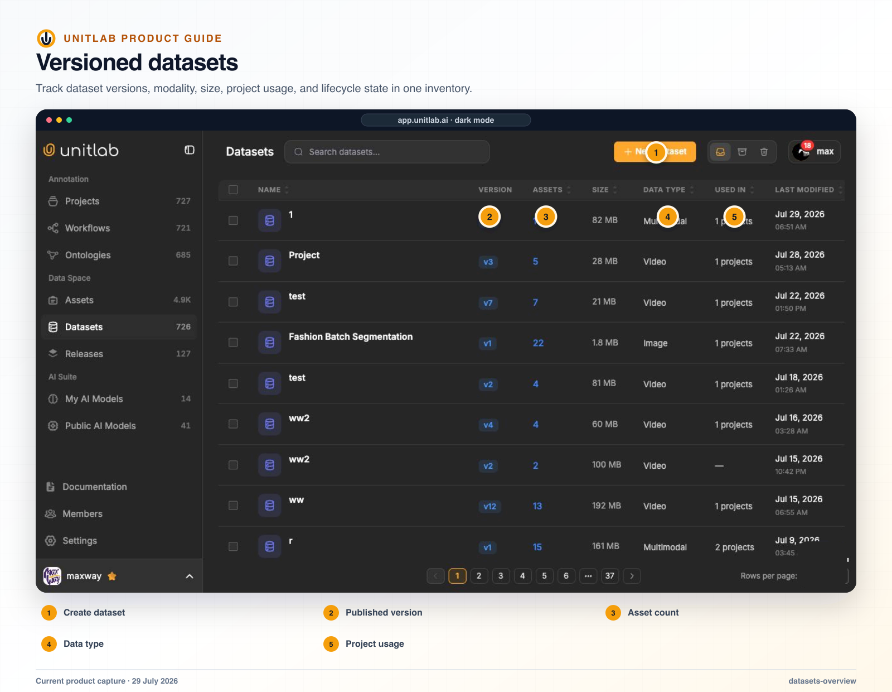


**Who this guide is for:** Data owners, project managers, ML engineers, and release consumers. **You will:** Publish a named dataset version whose membership and project usage are understandable and reproducible.


## Before you begin

- A Unitlab workspace and the role required for the operation.
- A representative pilot sample that includes normal and difficult cases.
- A named owner for the configuration, quality decision, or operational result.

## End-to-end flow

~~~mermaid
flowchart LR
  A["Reviewed source"]
  B["Dataset draft"]
  C["Published version"]
  D["Project attachment"]
  E["Release provenance"]
  A --> B
  B --> C
  C --> D
  D --> E
~~~

## Procedure



### 1. Define the dataset purpose, owner, source scope, and naming convention


### 2. Create the dataset from reviewed folders or Assets


### 3. Inspect draft membership and Unpublished changes


### 4. Publish a version with a meaningful title and description


### 5. Open version history and verify exact membership


### 6. Attach the explicit version to a pilot project


### 7. Use View Source to confirm provenance and review impact before Detach



## Product behavior and controls

## What a dataset is

A Unitlab dataset is a curated collection built from folders or individual assets. The live dataset table shows:

- name;
- version;
- asset count;
- size;
- data type;
- projects using the dataset;
- last modified date;
- creator.

Datasets can contain image, video, or multimodal data. Dataset lifecycle tabs include Active, Archived, and Trash.

## Version-first behavior

The SDK describes datasets as version-first:

1. Create a dataset from selected folders or assets.
2. Make edits, which appear as unpublished changes.
3. Publish a named version to freeze a snapshot.
4. Attach the latest or an exact version to a project.

This distinction prevents a project from silently changing when someone adds new assets to the working dataset. An exact attachment can reference, for example, dataset version 2 rather than “whatever the dataset contains today.”

The current model is:

```text
Folders and assets
        ↓
Mutable dataset working draft
        ↓ Publish version
Immutable DatasetVersion
        ↓ Attach
Independent project copy
```

There is no **Sync**, **Ignore**, or **Auto-Sync** action between a project and an attached Data Assets source. Editing the source after attachment does not alter the project. To adopt the change, the user publishes a newer dataset version and attaches that version.

## Datasets-list UX

The standalone Datasets page includes search, **New Dataset**, Active/Archived/Trash views, pagination, row selection, and a table with:

- Name;
- Version;
- Assets;
- Size;
- Data Type;
- Used in;
- Last Modified;
- Created By;
- Actions.

The Version cell is an orange **Draft vN** pill when publishing would create the next version, or a blue **vN** pill when the working draft matches the latest published version. Mixed-family datasets display **Multimodal**.

Row actions adapt to lifecycle state. Active datasets can be renamed, have files added, attach a published version to a project, archive, or move to Trash. Archived datasets can be restored to Active or trashed. Trash supports Restore or Delete forever. Dataset lifecycle changes affect the dataset and its versions/memberships; they do not archive or delete the underlying folders and assets.

## Create a dataset

1. The user selects **New Dataset**.
2. The user enters a name and optional description.
3. The user chooses at least one folder or asset from the lazy-loaded, server-searched source picker.
4. Unitlab creates the mutable working draft.
5. The dataset detail page opens with its folders and assets.
6. The user publishes v1 before the dataset can be attached to a project.

Adding files to an existing dataset adds existing workspace folders/assets to the working draft. It is not an upload-directly-into-dataset operation.

## Dataset detail and history

The default detail view is the live working draft. It includes a version dropdown, Grid/List browsing, **Publish version** when changes exist, and **Attach Data** for adding sources to the draft.

Selecting a published version opens a read-only snapshot. It preserves the frozen folder hierarchy, shows a **Read only** chip, and provides **Back to current**. No mutation or publish action appears in snapshot mode.

**View all versions** opens the single history modal. It contains the current working-draft card when dirty and one expandable card per published version. Available actions include:

- View version;
- Restore to working draft;
- Duplicate as new dataset.

Restore changes the working draft and requires a later Publish version action; it never creates a version immediately. Restore is unavailable for live-source-backed own-data or folder-tracking datasets because their draft follows the underlying source.

Changes that can trigger the Draft pill include adding/removing files, folder moves, renames, tag changes, and relevant dataset-name changes—not only item count.

## Dataset operations

The UI exposes rename, add files, attach to project, archive, and delete actions.

Automation adds:

- create from folder or asset IDs;
- add sources;
- inspect unpublished changes;
- publish a version with a title;
- list versions;
- list items for the current state or a specific version;
- preview attachment counts;
- attach the latest or an exact version;
- list and detach a project source.

Video attachments can require an explicit frames-per-second value. Both preview and commit validate this rule so an operator can discover the requirement before creating the project copy.

## Upload Data from a project

Project **Upload Data** uses the plain mixed-data uploader and has no destination-folder picker:

1. The user uploads one or more mixed files.
2. One upload action creates one Batch Queue.
3. Files land in the project’s own data under the project name.
4. The first upload lazily creates the project’s own folder and own-data dataset.
5. Unitlab waits for the batch to become quiet, then auto-publishes one new version for that upload batch.
6. The project Datasets view refreshes.

Project-side auto-publish applies only to the project’s own uploads. Uploading into a workspace Data Assets folder instead creates an unpublished change that still requires an explicit Publish version.

## Attach Data to a project

The project-side Attach Data modal has **Folders** and **Datasets** tabs; there is no loose Assets tab. Organize loose assets into a folder or dataset first.

1. The user opens **Attach Data**.
2. The user selects a workspace folder or a published dataset version.
3. Sources already fully attached are pre-checked, locked, and labeled Attached. This state is evaluated per version, so attaching v1 does not block v2.
4. Unitlab previews item and deduplication counts.
5. Commit clones the frozen version into the project as Unassigned data without re-uploading the files.
6. The newly attached items are selected automatically.
7. The Assign Members modal opens so annotator/reviewer assignment can continue immediately.

Attaching a folder first resolves it through a folder-backed dataset and frozen version. Attaching another project’s data includes only that project’s own source data; sources that were merely attached into that project do not cascade into the next project.

## Project dataset cards, View Source, and Detach

The project’s own data and every attached version appear as uniform dataset cards. Root-card actions include:

- **View Source** — opens the underlying project dataset, folder, or frozen version without mutation;
- **Detach** — removes that source from this project only.

Detach shows source name, asset count, and annotation count. By default it archives the project copies while preserving annotations. The user can explicitly choose **Clear annotations**, which requires a stronger confirmation. Re-attaching restores the archived project rows and kept histories instead of creating duplicates. Other projects and the Data Assets source remain unchanged.

## Dataset versus folder

A folder answers, “Where did these files come from?” A dataset answers, “Which controlled collection are we using for this experiment or project?” One source folder may feed several datasets; one dataset may combine multiple source folders and selected exceptions.

## Dataset versus release

A dataset is the changing input collection. A release is the downstream annotation snapshot. Teams should not use a folder name or mutable dataset title as the only identifier for a model run.

## Verify the result

- [ ] The visible result matches the project Instructions and active ontology.
- [ ] The workflow stage, assignee, and queue state are correct.
- [ ] A second user with the intended role can reproduce the result.
- [ ] Downstream dataset or release behavior remains correct.

## Failure modes and recovery

| Symptom | What to check |
|---|---|
| The expected action is unavailable | Check the active workflow stage, user role, selected item, and whether the required resource is Live or still processing. |
| The result appears incomplete | Inspect filters, source membership, Data Group membership, invalid state, and Batch Queue failures before repeating the operation. |
| A change affects existing work | Stop the rollout, identify affected items and versions, validate a recovery path on a sample, and document the change owner. |

## Operational record

For a material change, record the workspace, project, source or dataset version, ontology version, workflow stage, affected item or Batch Queue IDs, responsible owner, validation sample, result, and downstream release impact. Never include API keys, cloud credentials, signed download URLs, or regulated source data in tickets or logs.

## Product view



*Dataset management separates reusable membership from published versions used by projects and downstream operations.*

