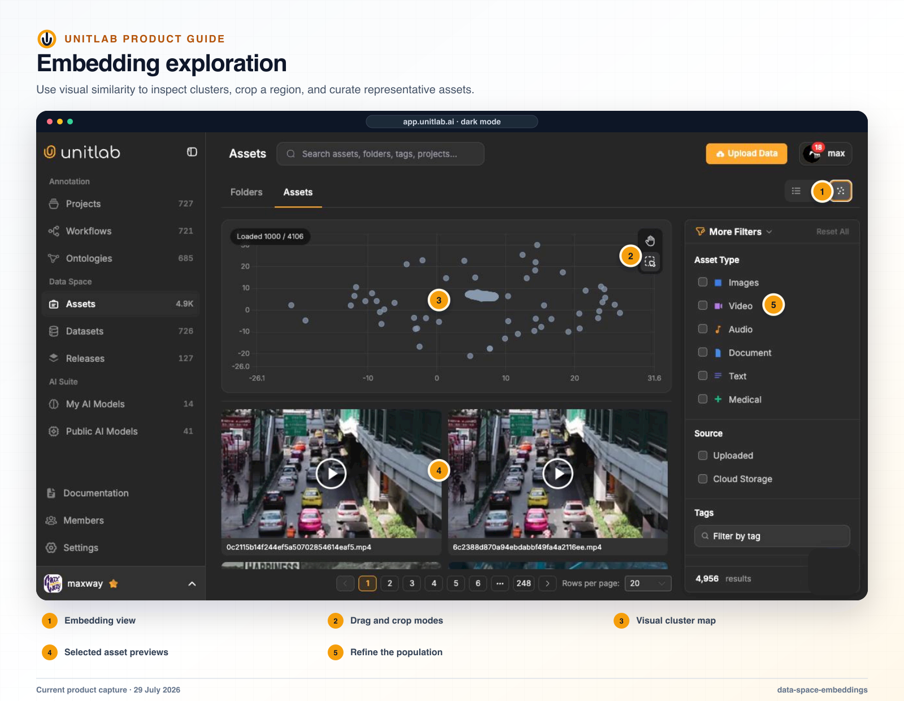


**Who this guide is for:** Data curators, ML engineers, reviewers, and quality leads. **You will:** Use vector evidence to identify candidates for inspection without treating proximity as a label or quality decision.


## Before you begin

- A Unitlab workspace and the role required for the operation.
- A representative pilot sample that includes normal and difficult cases.
- A named owner for the configuration, quality decision, or operational result.

## End-to-end flow

~~~mermaid
flowchart LR
  A["Source scope"]
  B["Embedding space"]
  C["Distribution"]
  D["Candidate cohort"]
  E["Human verification"]
  A --> B
  B --> C
  C --> D
  D --> E
~~~

## Procedure



### 1. Choose the source scope and compatible embedding space


### 2. Open Embedding view and confirm the active filters


### 3. Inspect global distribution before zooming into clusters or outliers


### 4. Select a representative seed or query vector


### 5. Review nearest neighbors, duplicates, outliers, or UMAP neighborhoods in source context


### 6. Tag, filter, group, or version the verified result cohort


### 7. Record the embedding model and source version used for the decision



## Product behavior and controls

The embedding view projects embeddable assets into a visual space and supports drag or crop-style region selection. Users can select a cluster and review its associated thumbnails before adding, excluding, or organizing the selected assets.

Useful curation patterns include:

- locating dense duplicate or near-duplicate regions;
- sampling from visually distinct clusters;
- finding outliers and rare conditions;
- comparing source domains;
- building a more diverse pilot dataset;
- selecting negative examples near a target class.

The two-dimensional plot is a navigation aid, not a guarantee that every nearby point is semantically identical. Operators should inspect the actual assets before turning a region into a dataset.

## Custom embedding spaces and vector search

The SDK can create named embedding spaces with a specified dimensionality and optional model name, upload vectors for an asset or a video frame, bulk-upsert vectors, search by a query vector, and optionally scope the search to a project or level.

This allows teams to use Unitlab’s curation interface while retaining control over the embedding model and vector space used for similarity operations.

## Search, duplicates, outliers, and UMAP

Unitlab includes visual similarity search, natural-language CLIP-style search, duplicate detection, outlier detection, quality-inconsistency checks, and UMAP visualization. These embedding and visual exploration experiences are available for image and video data.

## Verify the result

- [ ] The visible result matches the project Instructions and active ontology.
- [ ] The workflow stage, assignee, and queue state are correct.
- [ ] A second user with the intended role can reproduce the result.
- [ ] Downstream dataset or release behavior remains correct.

## Failure modes and recovery

| Symptom | What to check |
|---|---|
| The expected action is unavailable | Check the active workflow stage, user role, selected item, and whether the required resource is Live or still processing. |
| The result appears incomplete | Inspect filters, source membership, Data Group membership, invalid state, and Batch Queue failures before repeating the operation. |
| A change affects existing work | Stop the rollout, identify affected items and versions, validate a recovery path on a sample, and document the change owner. |

## Operational record

For a material change, record the workspace, project, source or dataset version, ontology version, workflow stage, affected item or Batch Queue IDs, responsible owner, validation sample, result, and downstream release impact. Never include API keys, cloud credentials, signed download URLs, or regulated source data in tickets or logs.

## Product view

*Embedding view helps operators inspect global distribution, clusters, duplicates, and outlier candidates before creating a durable cohort.*

