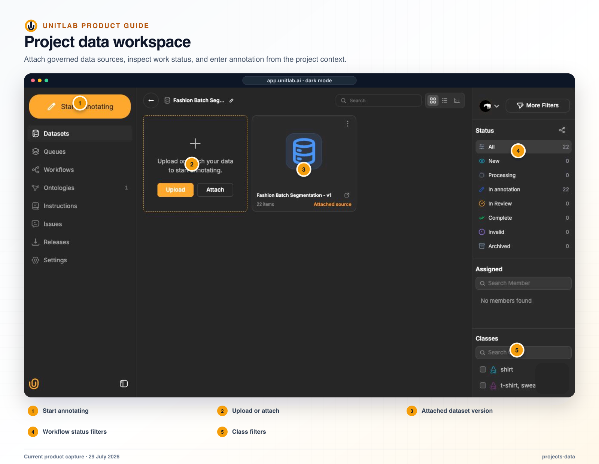


**Who this guide is for:** Project managers, reviewers, and quality leads. **You will:** Define a quality cohort, inspect it consistently, and route the correct item-level response without losing project context.


## Before you begin

- A Unitlab workspace and the role required for the operation.
- A representative pilot sample that includes normal and difficult cases.
- A named owner for the configuration, quality decision, or operational result.

## End-to-end flow

~~~mermaid
flowchart LR
  A["Define cohort"]
  B["Choose view"]
  C["Normalize display"]
  D["Find pattern"]
  E["Route item"]
  A --> B
  B --> C
  C --> D
  D --> E
~~~

## Procedure



### 1. Open the project Datasets page and enter the intended source


### 2. Define the cohort with status, assignment, class, property, Item Property, issue, tag, search, or saved-filter conditions


### 3. Choose Grid for visual scanning, List for operations, or Embedding for distribution and outliers


### 4. Set card density and Display View consistently


### 5. Isolate class and property visibility and inspect the cohort


### 6. Open a questionable item in the Workbench


### 7. Comment, create an issue, approve, reject, or escalate through the active workflow stage



## Product behavior and controls

The project Datasets page is also a quality-inspection surface. It combines workflow filters, assignment filters, semantic filters, card-density controls, and annotation-aware display settings so a manager or reviewer can find a problematic cohort and inspect it consistently before opening individual items.

**QA entry points**

| Control | What it helps the user inspect |
|---|---|
| Workflow stage and status | New, in-annotation, in-review, processing, complete, archived, error, and invalid cohorts |
| Assigned | Work owned by a particular annotator or reviewer, or work that remains unassigned |
| Classes, properties, and Item Properties | Items containing selected ontology content or missing the expected semantic coverage |
| Issues and tags | Known exceptions, escalations, and project-specific quality categories |
| Search and Advanced Filters | A precise subset defined by file, workflow, ontology, assignment, or saved-preset conditions |
| Grid, List, and Embedding views | Visual inspection, operational table review, or distribution/outlier exploration |
| Card-size slider | More items for rapid scanning or larger cards for closer visual inspection |
| Display View | Annotation-rendering controls applied consistently across the visible cards |

The **Display View** panel contains:

- **Show object names** — renders class/object names on the visible annotations;
- **Color by object ID** — assigns visual identity by instance rather than only by class, which is useful for distinguishing nearby or overlapping objects;
- **Crop view** — focuses each card on its annotated region when close inspection matters more than full-image context;
- **Additional zoom** — increases the inspection scale inside the crop;
- **Boundary thickness** — adjusts annotation-edge thickness;
- **Border opacity**, **Vector opacity**, and **Mask opacity** — independently control the visibility of outlines, vector geometries, and filled masks;
- **Classes** — searchable per-class visibility controls, with expandable **Properties** and **Attributes** visibility where those structures exist.

These are visual QA controls. They do not modify annotation geometry, ontology values, workflow state, or source media. Advanced Filters determine which items are in the result set; Display View determines how their annotations are rendered for inspection.

**Visual QA flow**

1. Open a project dataset and define the cohort with search, status, assignment, class/property, issue, tag, or saved-filter conditions.
2. Choose Grid for visual scanning, List for operational comparison, or Embedding for distribution and outlier inspection.
3. Adjust card size to balance cohort coverage against image detail.
4. Open **Display View** and enable the object names, object-ID coloring, crop, zoom, boundary, and opacity settings needed for the annotation type under review.
5. Search or isolate classes and, when necessary, expand their properties or attributes to remove unrelated overlays.
6. Inspect the visible cohort, then open a questionable item in the Workbench without losing the surrounding project context.
7. Use a comment for item-specific discussion, create or update an issue when ownership and follow-through are required, or use the current Review-stage action to approve or return the item for correction.

This flow supports cohort-first QA: the reviewer can first identify a repeated pattern across many items, then move into the exact annotation context where a correction or workflow decision is made.

## Project settings

Project settings support rename, access-permission inspection, delete, and—when relevant to text work—allowing source-text editing. The project shell can also surface subscription or quota alerts that affect the current action.

## Verify the result

- [ ] The visible result matches the project Instructions and active ontology.
- [ ] The workflow stage, assignee, and queue state are correct.
- [ ] A second user with the intended role can reproduce the result.
- [ ] Downstream dataset or release behavior remains correct.

## Failure modes and recovery

| Symptom | What to check |
|---|---|
| The expected action is unavailable | Check the active workflow stage, user role, selected item, and whether the required resource is Live or still processing. |
| The result appears incomplete | Inspect filters, source membership, Data Group membership, invalid state, and Batch Queue failures before repeating the operation. |
| A change affects existing work | Stop the rollout, identify affected items and versions, validate a recovery path on a sample, and document the change owner. |

## Operational record

For a material change, record the workspace, project, source or dataset version, ontology version, workflow stage, affected item or Batch Queue IDs, responsible owner, validation sample, result, and downstream release impact. Never include API keys, cloud credentials, signed download URLs, or regulated source data in tickets or logs.

## Product view

*Project Data provides Grid, List, and Embedding inspection paths for cohort-level quality analysis.*

