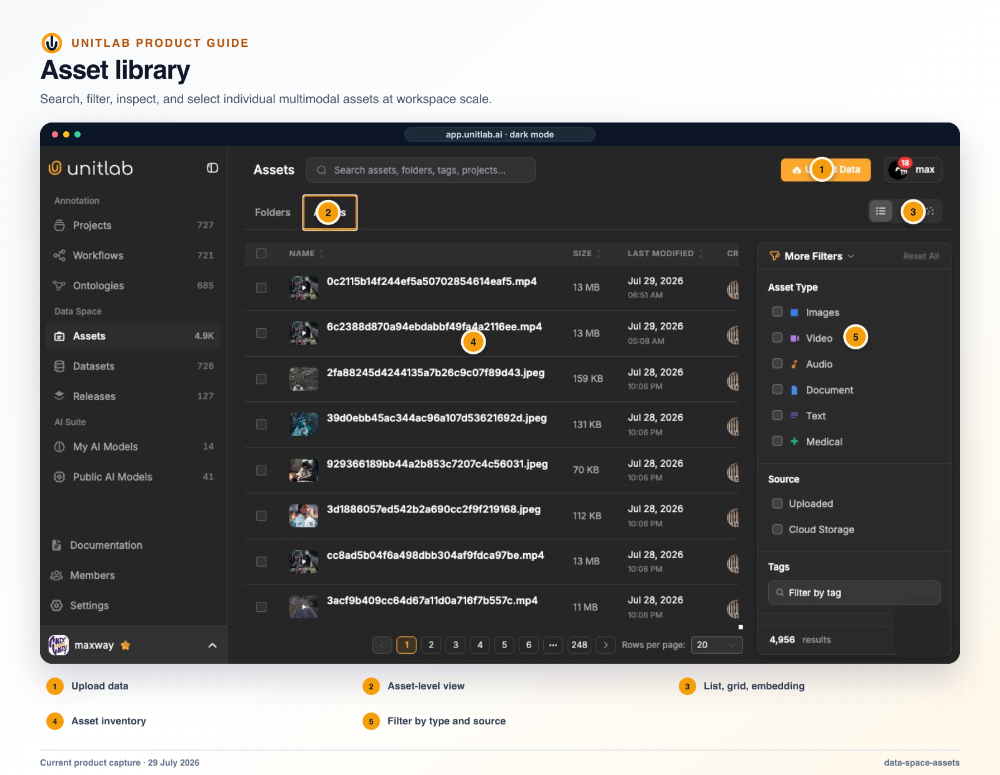


**Who this guide is for:** Data owners, curators, and workspace administrators. **You will:** Organize and lifecycle source data without confusing source state with project workflow state.


## Before you begin

- A Unitlab workspace and the role required for the operation.
- A representative pilot sample that includes normal and difficult cases.
- A named owner for the configuration, quality decision, or operational result.

## End-to-end flow

~~~mermaid
flowchart LR
  A["Locate source"]
  B["Inspect state"]
  C["Resolve targets"]
  D["Apply action"]
  E["Verify dependencies"]
  A --> B
  B --> C
  C --> D
  D --> E
~~~

## Procedure



### 1. Open Data Space and choose Folders or Assets


### 2. Select Active, Archived, or Trash intentionally


### 3. Search or navigate to the exact folder and inspect row activity


### 4. Select items and review the resolved target count


### 5. Apply the intended tag, archive, restore, or trash action


### 6. Re-run the filter and confirm project or dataset dependencies



## Product behavior and controls

## Asset library

The Asset library separates Folders and Assets and provides list, grid, and embedding views. It supports:

- upload;
- search;
- selection and bulk actions;
- list and grid presentation;
- sorting by name, size, modification date, and creator;
- folder organization;
- pagination;
- active, archived, and trash lifecycle states.

Search covers assets, folders, tags, and projects. The current list view makes source, size, modification date, and creator visible, which helps operational teams answer where data came from and who changed it.

Automation supports folder creation, nested subfolders, folder listing, asset upload, asset-level custom metadata, cloud-folder creation, and synchronization.

## Workspace Data Space navigation

Data Space has three separate top-level pages:

- **Assets** — a Folders/Assets tabbed workspace library;
- **Datasets** — the standalone versioned dataset list;
- **Releases** — versioned project annotation snapshots.

The Assets page mirrors active tab and pagination in the URL. Folder detail presents one file-explorer list containing child folders, loose assets, and Data Groups. Breadcrumbs preserve the full path.

The Assets tab shows one source-of-truth row per asset rather than every clone created in every project. Source identity is reused when a published version is attached, so duplicate project copies do not inflate the workspace asset count.

## Lifecycle and bulk actions

Folders, assets, and datasets share three lifecycle views:

- **Active** — available for normal use;
- **Archived** — reversibly set aside;
- **Trash** — recoverable deletion state.

Hard deletion is available only from Trash. Selecting rows opens a floating action bar whose choices adapt to the current lifecycle. Depending on the object and state, actions include Move, Tags, Download, Archive, Unarchive, Restore, Delete, Delete forever, and Attach to project.

For Download, one selected workspace file downloads directly. Multiple selected files produce a manifest of secure file URLs rather than silently building an unbounded archive in the browser.

Deleting data that is still attached to projects is a two-phase flow: Unitlab first shows affected projects and requires the relevant source links to be detached. This reduces the risk that a workspace administrator deletes source data without seeing its downstream use.

## Row actions and activity

Folder and asset row actions include Open, Rename, Move, Download, Archive, Tag, Activity, and Delete where the backing supports them. Opening **Activity** replaces the filter sidebar with a read-only, newest-first timeline showing who changed what, when, affected-file counts, and rename/move/metadata differences. Users can search or filter events and download the complete affected-file JSON for a large change.

The activity record remains available after the original subject is permanently deleted. Objects created before activity tracking was enabled can have an empty history because earlier events are not reconstructed.

## Verify the result

- [ ] The visible result matches the project Instructions and active ontology.
- [ ] The workflow stage, assignee, and queue state are correct.
- [ ] A second user with the intended role can reproduce the result.
- [ ] Downstream dataset or release behavior remains correct.

## Failure modes and recovery

| Symptom | What to check |
|---|---|
| The expected action is unavailable | Check the active workflow stage, user role, selected item, and whether the required resource is Live or still processing. |
| The result appears incomplete | Inspect filters, source membership, Data Group membership, invalid state, and Batch Queue failures before repeating the operation. |
| A change affects existing work | Stop the rollout, identify affected items and versions, validate a recovery path on a sample, and document the change owner. |

## Operational record

For a material change, record the workspace, project, source or dataset version, ontology version, workflow stage, affected item or Batch Queue IDs, responsible owner, validation sample, result, and downstream release impact. Never include API keys, cloud credentials, signed download URLs, or regulated source data in tickets or logs.

## Product view

*Data Space presents durable source assets in a controlled library with type, lifecycle, metadata, and bulk-action context.*

