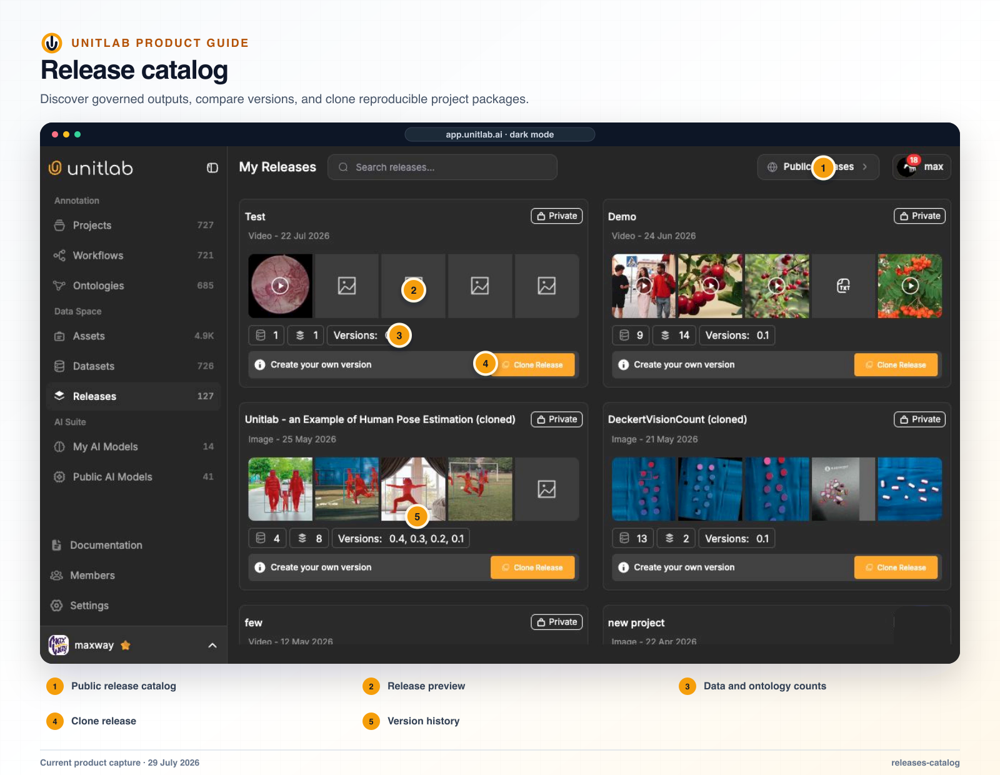
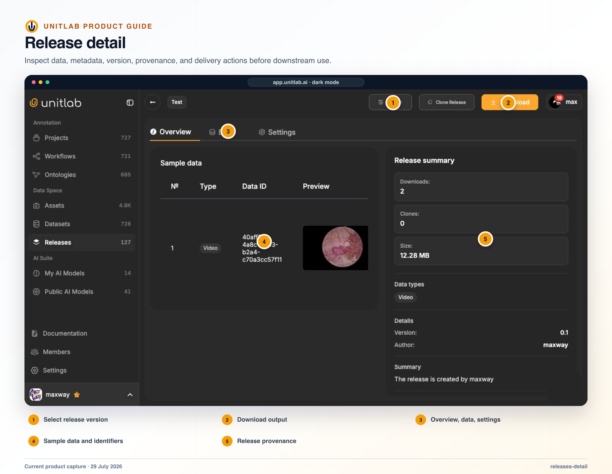


**Who this guide is for:** Release managers, project owners, ML engineers, data engineers, and auditors. **You will:** Create a named release that a downstream consumer can validate and reproduce.


## Before you begin

- Approved project content and resolved invalid, failed, or escalated work.
- A downstream format and split contract.
- A decision about source files, stable item URLs, download tokens, and license context.
- Permission to create releases and an owner for downstream validation.

## End-to-end flow

~~~mermaid
flowchart LR
  A["Approved work"]
  B["Export contract"]
  C["Create"]
  D["Inspect"]
  E["Downstream validation"]
  A --> B
  B --> C
  C --> D
  D --> E
~~~

## Procedure



### 1. Define the release purpose, version, owner, included sources, data types, and exclusions


### 2. Choose an export format that preserves required geometry and ontology values


### 3. Configure train, validation, test, or other splits


### 4. Choose source inclusion, stable URLs, tokens, and multimodal bundle formats intentionally


### 5. Create the release and monitor processing


### 6. Inspect Overview, Data, and Settings for count, sample content, provenance, version, and readiness


### 7. Download annotations and optional source files


### 8. Validate schema, geometry, media paths, group context, and split membership in the downstream consumer


### 9. Record the release ID, version, dataset versions, ontology, workflow, model, format, splits, exclusions, and validation result



## Product behavior and controls

## What a release contains

A release is a versioned annotation snapshot with:

- visibility such as Private or Public;
- modality;
- version number;
- creation date;
- item counts;
- data preview;
- annotation preview;
- Clone Release;
- Overview, Data, and Settings tabs;
- item type, data ID, preview, ground truth, and metadata.

A release can contain video, document, and audio items together. Metadata is represented as structured content: video metadata can include frame, video, and audio facts, while document metadata includes PDF and page information.

## Release creation flow

Releases are created from a project’s Releases page:

1. The user opens the export dialog.
2. The user chooses the source scope: the full project or one/more Batch Queues.
3. The user selects one or more data families inside that scope.
4. Unitlab previews releasable counts, annotation/review progress, format compatibility, and recommended format.
5. The user chooses an export format or per-family Standard Bundle formats.
6. The user selects a license when required.
7. The user enters nonnegative integer train, validation, and test percentages that sum to 100.
8. The user optionally enables stable tokenized item URLs.
9. Unitlab creates the versioned release.

Invalid latest histories are excluded from ordinary releasable counts. Cloud-storage-sourced releases are forced private.

## Release areas and read-only viewing

Data Space contains **My Releases** and **Public Releases**, toggled from the page header. A release detail contains Overview, Data, and—on private workspace releases—Settings.

Opening a release item uses a separate read-only annotation viewer for Image, Video, Audio, Text, Medical, or Document. It reuses the familiar modality surface but disables mutation. This lets teams inspect exactly what a release contains without accidentally changing the project history that produced it.

Making a release public requires license selection. Release deletion is permission- and subscription-gated. If the latest release version is deleted, the previous version becomes latest.

## Export formats

Working converters include:

| Data family | Supported formats |
|---|---|
| Image | COCO, YOLOv8, YOLOv5, UUEF |
| Video | COCO, YOLOv8, YOLOv5, UUEF |
| Medical | COCO, YOLOv8, YOLOv5, UUEF |
| Document/PDF | UUEF only |
| Text | JSONL, UUEF |
| Audio | Audio JSON, RTTM, UUEF |

Native single-family formats apply to one compatible family. A release containing more than one family must use **UUEF** or **Standard Bundle**.

- **UUEF** is the universal full-fidelity format. It preserves properties, attributes, relations, item properties, tags, page/frame context, and the richer annotation graph.
- **Standard Bundle** creates one ZIP containing a native output per selected family plus a manifest describing the release, source scope, selected types, split ratios, written files, and omitted empty combinations.

Default Standard Bundle choices are COCO for image/video/medical, JSONL for text, and Audio JSON for audio. Document data uses UUEF.

## SDK export behavior

The SDK can:

- create a release from a project;
- specify `export_type="UUEF"`;
- define split ratios such as 80% train and 20% test;
- list and retrieve releases;
- download annotations for a selected split;
- download associated files to a destination folder.

The SDK supports UUEF creation and split-aware annotation and file downloads. The complete release format matrix is shown above.

## Cloning and reproducibility

Clone Release supports controlled branching. The user can clone with annotations or as datasource-only content, choose the new project name, and continue from the new project’s Data page. Unitlab creates a completed Batch Queue for cloned rows so queue and data views remain consistent.

A team can preserve a known release, create a new branch for correction or experimentation, and avoid rewriting the historical data associated with an earlier model run.

Private release Data pages also provide a new-version and augmentation flow for creating a derived version while preserving the original release.

## Stable release item URLs

When enabled during release creation, Unitlab can issue tokenized, stable item URLs—including frame-specific video/medical URLs—that redirect to fresh storage links. A release being public does not automatically make every underlying item URL anonymous; tokenized access must be explicitly enabled.

A model experiment should record at least:

- release ID and version;
- dataset source versions;
- ontology version;
- split policy;
- model and prompt/configuration version;
- known exclusions;
- evaluation result.

## Verify the result

- [ ] The visible result matches the project Instructions and active ontology.
- [ ] The workflow stage, assignee, and queue state are correct.
- [ ] A second user with the intended role can reproduce the result.
- [ ] Downstream dataset or release behavior remains correct.

## Failure modes and recovery

| Symptom | What to check |
|---|---|
| The expected action is unavailable | Check the active workflow stage, user role, selected item, and whether the required resource is Live or still processing. |
| The result appears incomplete | Inspect filters, source membership, Data Group membership, invalid state, and Batch Queue failures before repeating the operation. |
| A change affects existing work | Stop the rollout, identify affected items and versions, validate a recovery path on a sample, and document the change owner. |

## Operational record

For a material change, record the workspace, project, source or dataset version, ontology version, workflow stage, affected item or Batch Queue IDs, responsible owner, validation sample, result, and downstream release impact. Never include API keys, cloud credentials, signed download URLs, or regulated source data in tickets or logs.

## Product view

*The Releases area records versioned delivery artifacts and their processing state.*

*Release detail exposes the exact version, content, configuration, and validation context used by downstream consumers.*

