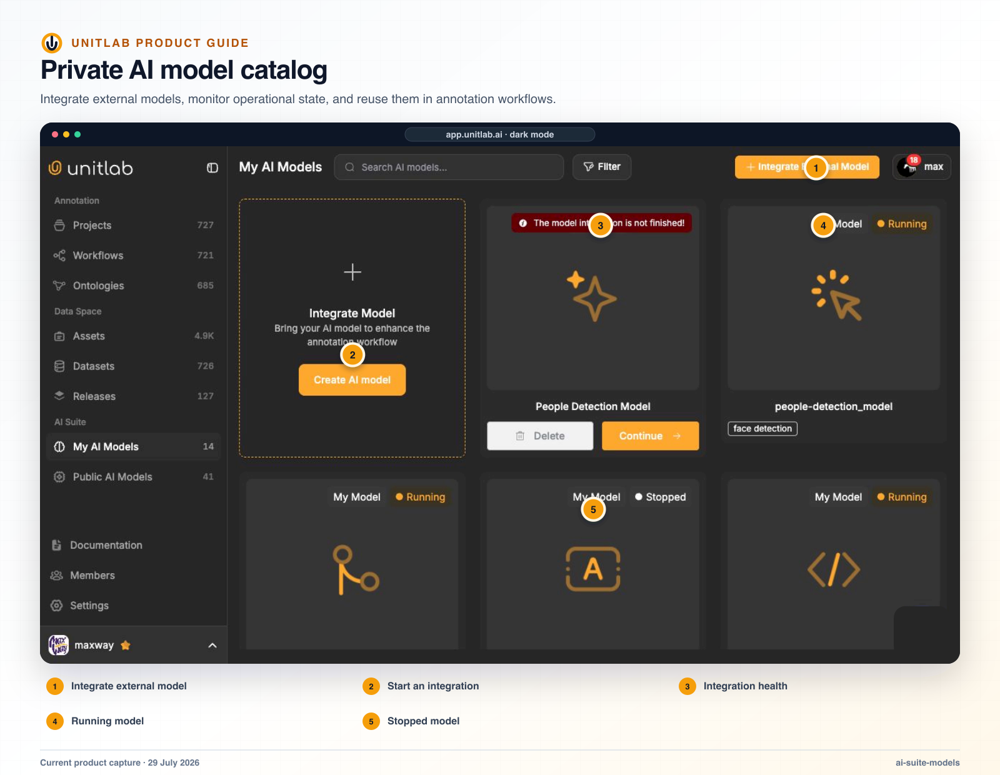


**Who this guide is for:** ML engineers, ML operations, security, and project managers. **You will:** Introduce a model into assisted annotation or workflow stages without creating an unowned production dependency.


## Before you begin

- A Unitlab workspace and the role required for the operation.
- A representative pilot sample that includes normal and difficult cases.
- A named owner for the configuration, quality decision, or operational result.

## End-to-end flow

~~~mermaid
flowchart LR
  A["Contract"]
  B["Integration"]
  C["Mapping"]
  D["Failure test"]
  E["Human-controlled rollout"]
  A --> B
  B --> C
  C --> D
  D --> E
~~~

## Procedure



### 1. Define the model task, owner, version, input, output, ontology mapping, and acceptance gate


### 2. Select a public model or start the external-model integration wizard


### 3. Configure the approved endpoint or runtime and secret reference


### 4. Map supported data types, classes, geometries, and output fields


### 5. Test success, empty output, timeout, malformed output, and partial failure


### 6. Place the model in a controlled workflow stage or assisted operation


### 7. Measure systematic errors and human correction by source domain


### 8. Version and review changes to model, endpoint, mapping, or credentials



## Product behavior and controls

## Public and private catalogs

Unitlab separates **My AI Models** from **Public AI Models**. Private model states include Running, Stopped, and Integration unfinished.

Model use cases include:

- object/person detection;
- open-vocabulary detection;
- image and video segmentation;
- polygon detection;
- human pose/skeleton detection;
- cuboid or other visual geometry;
- OCR and document OCR;
- speech-to-text and speech recognition;
- audio segmentation;
- general multimodal models.

## External-model integration wizard

The wizard follows:

1. Registration
2. Validation
3. Integration
4. Confirmation

Supported model input types are Image, Video, Audio, Text, and Medical.

Visual result types include bounding box, polygon, mask, skeleton, line, point, and cuboid. Audio can return an Event and optional speech-recognition transcript. Text can return an Entity.

Configuration includes:

- model name and description;
- endpoint;
- request headers and parameters;
- required source-data parameter;
- OCR-output option;
- validation;
- tags;
- class creation or mapping;
- integer class mapping;
- update or delete integration.

The default request structure includes a source-data URL. Credentials and request headers are managed as part of the private model integration.

## Integration discipline

Before a model is added to production, define:

- input contract and supported media;
- response schema and coordinate system;
- ontology mapping;
- timeout, retry, and failure behavior;
- authentication and secret rotation;
- confidence interpretation;
- abstention behavior;
- validation data;
- human correction route;
- traceability fields needed in the release.

## Verify the result

- [ ] The visible result matches the project Instructions and active ontology.
- [ ] The workflow stage, assignee, and queue state are correct.
- [ ] A second user with the intended role can reproduce the result.
- [ ] Downstream dataset or release behavior remains correct.

## Failure modes and recovery

| Symptom | What to check |
|---|---|
| The expected action is unavailable | Check the active workflow stage, user role, selected item, and whether the required resource is Live or still processing. |
| The result appears incomplete | Inspect filters, source membership, Data Group membership, invalid state, and Batch Queue failures before repeating the operation. |
| A change affects existing work | Stop the rollout, identify affected items and versions, validate a recovery path on a sample, and document the change owner. |

## Operational record

For a material change, record the workspace, project, source or dataset version, ontology version, workflow stage, affected item or Batch Queue IDs, responsible owner, validation sample, result, and downstream release impact. Never include API keys, cloud credentials, signed download URLs, or regulated source data in tickets or logs.

## Product view

*AI model management keeps endpoint, model, ownership, and operational state visible before automation enters a workflow.*

