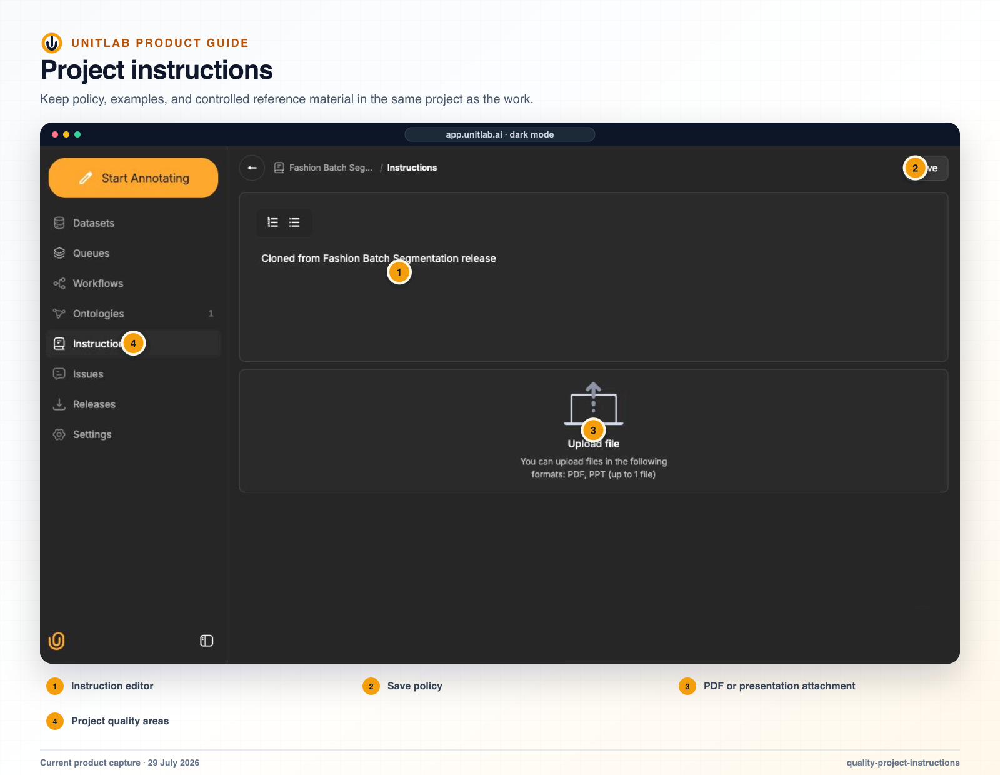


**Who this guide is for:** Quality leads, project managers, annotators, reviewers, and specialist reviewers. **You will:** Detect systematic error, explain item-level correction, route ownership, and verify the corrected cohort.


## Before you begin

- A Unitlab workspace and the role required for the operation.
- A representative pilot sample that includes normal and difficult cases.
- A named owner for the configuration, quality decision, or operational result.

## End-to-end flow

~~~mermaid
flowchart LR
  A["Policy"]
  B["Calibration"]
  C["Cohort QA"]
  D["Issue or review"]
  E["Verified correction"]
  A --> B
  B --> C
  C --> D
  D --> E
~~~

## Procedure



### 1. Publish Instructions with inclusion, exclusion, ambiguity, invalid-data, geometry, attribute, and acceptance rules


### 2. Calibrate annotators and reviewers on the same hard examples


### 3. Use cohort QA to find repeated error patterns


### 4. Use comments for contextual discussion and Issues for owned follow-through


### 5. Approve, reject, or escalate through the current workflow stage


### 6. Use notifications for awareness and queues for operational ownership


### 7. Review statistics together with error patterns and calibrated samples


### 8. Update Instructions, ontology, and workflow together when policy changes



## Product behavior and controls

Quality is distributed across several product surfaces rather than contained in one “QA” button.

## Project instructions

Instructions can contain:

- rich text/description;
- external URL;
- file attachment;
- PDF upload;
- PPT upload.

Instructions should be the current operational standard an annotator can consult while working. They should include definitions, decision rules, hard examples, counterexamples, uncertainty policy, and escalation steps.

## Comments

Comments live inside the annotation workbench and are appropriate for context attached to a specific item or label. They should not become the only place where a repeated rule is documented; recurring decisions belong in the instructions or ontology.

## Issues

Project issues include content, status, responsible member, creator, and created date. Issue links can return the user to the exact annotation context and load the correct editor for that item’s data family. An issue is appropriate when a problem requires ownership and follow-through beyond one annotation comment.

## Review and specialist escalation

Review is an explicit workflow decision. Specialist escalation can be modeled as another Review stage with a restricted eligible-member list. A useful closed loop is:

```text
Annotation or policy error
    ↓
Reviewer correction or rejection
    ↓
Issue categorized
    ↓
Ontology, instruction, model, or assignment change
    ↓
New tasks measured for recurrence
```

The most important quality metric is not raw labeling speed. It is accepted, usable units per hour after correction, rework, and downstream failures are included.

## Notifications

Workflow-aware notifications include stage-ready, task-assigned, task-claimed, rework, comment, mention, automation, and conflict events. The notification list supports bulk actions. Rework notifications are particularly important because they connect a reviewer’s rejection to the annotator who must correct it.

## Statistics and team visibility

Statistics appear at project and member levels. Current surfaces include:

- project overview charts;
- monthly progress;
- daily time series;
- overall progress;
- average time per item;
- total working time;
- issue counts;
- annotator and reviewer breakdowns;
- member heatmaps and summaries;
- workspace member statistics pages.

Some statistics and premium role experiences depend on the workspace subscription. Statistics should be interpreted with workflow context—for example, faster annotation can coexist with higher reviewer rejection and should not be reported as improved productivity in isolation.

## Verify the result

- [ ] The visible result matches the project Instructions and active ontology.
- [ ] The workflow stage, assignee, and queue state are correct.
- [ ] A second user with the intended role can reproduce the result.
- [ ] Downstream dataset or release behavior remains correct.

## Failure modes and recovery

| Symptom | What to check |
|---|---|
| The expected action is unavailable | Check the active workflow stage, user role, selected item, and whether the required resource is Live or still processing. |
| The result appears incomplete | Inspect filters, source membership, Data Group membership, invalid state, and Batch Queue failures before repeating the operation. |
| A change affects existing work | Stop the rollout, identify affected items and versions, validate a recovery path on a sample, and document the change owner. |

## Operational record

For a material change, record the workspace, project, source or dataset version, ontology version, workflow stage, affected item or Batch Queue IDs, responsible owner, validation sample, result, and downstream release impact. Never include API keys, cloud credentials, signed download URLs, or regulated source data in tickets or logs.

## Product view


*Quality operations connect review queues and item-level decisions to accountable follow-through.*



*Instructions remain the operational source of truth for acceptance, ambiguity, invalid-data, and escalation policy.*

