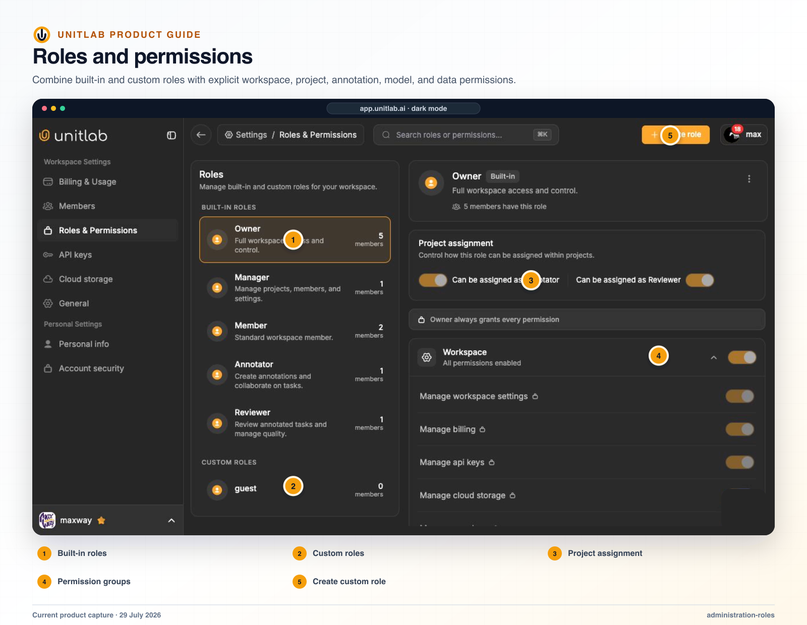


**Who this blueprint is for:** Solution architects, program owners, project managers, quality leads, and downstream data consumers. **Outcome:** Approve production volume only after access, data, policy, workflow, quality, automation, and delivery have been exercised together.


## Decision to make

State the operational or model decision in one sentence. Then list the minimum evidence, temporal or spatial context, allowed uncertainty, and downstream representation required to make that decision consistently. Do not begin with a tool list; begin with the decision contract.

## Before you begin

- A named business or model decision that the data program must support.
- Representative normal, difficult, ambiguous, invalid, and failure examples.
- Named owners for source data, labeling policy, annotation operations, review, and downstream acceptance.
- A downstream consumer that can validate one sample release.

## Operating blueprint

~~~mermaid
flowchart LR
  A["Design"]
  B["Representative pilot"]
  C["Evidence review"]
  D["Controlled scale"]
  E["Continuous review"]
  A --> B
  B --> C
  C --> D
  D --> E
~~~

## Implementation



### 1. Design the unit of work, data contract, ontology, Instructions, workflow, roles, quality evidence, and release acceptance


### 2. Select a representative pilot cohort including normal, difficult, ambiguous, invalid, rejected, failed, and rare cases


### 3. Configure the complete flow and train each role on the same calibration examples


### 4. Operate the pilot end to end and fix systemic gaps in policy, configuration, training, or integration


### 5. Validate one release in the actual downstream consumer


### 6. Run a production-readiness review with named owners, conditions, and acceptance evidence


### 7. Scale in controlled cohorts with volume, quality, failure, model, and delivery monitors


### 8. Trigger review after material product, source, ontology, workflow, role, model, or export changes



## Current Unitlab capabilities

## Pattern A: multiview factory inspection

**Problem:** The same item appears in four camera views. Treating each recording as an independent task can create inconsistent identity and defect decisions.

**Unitlab pattern:**

1. Ingest the four camera files with consistent identifiers.
2. Use auto-grouping to create one Data Group per inspected item.
3. Arrange four video tiles in a custom layout.
4. Define object classes and defect properties in the ontology.
5. Use tracking or interpolation within each view.
6. Route uncertain cases to a specialist-configured Review stage.
7. Publish a release that preserves the grouped case.

This workflow keeps the four views connected from curation through release, so annotators can make one case-level decision with all relevant visual context available.

## Pattern B: agriculture and repeated objects

**Problem:** A frame contains many similar cherries, and the same scene is captured from two angles.

**Unitlab pattern:**

1. Group the two camera views.
2. Annotate one trusted seed object.
3. Run Find Similar.
4. Adjust the confidence threshold and inspect candidates.
5. Accept only valid suggestions.
6. Continue tracking across frames if the data is video.

This workflow combines multiview context with seed-based assistance, reducing repetitive drawing while keeping acceptance under annotator control.

## Pattern C: medical study with contextual documentation

**Problem:** A finding must be understood across axial, sagittal, coronal, and 3D views, while a clinical document provides case context.

**Unitlab pattern:**

1. Upload or import the medical study and document.
2. Preserve study identity through grouping.
3. Use a custom layout with synchronized medical views and the document.
4. Annotate anatomy with geometry.
5. Record findings through conditional ontology properties.
6. Route the task through specialist review.
7. Export a controlled release after de-identification and governance checks.

This workflow keeps medical volumes and contextual documents together, allowing the specialist to review the case across synchronized views before release.

## Pattern D: customer interaction across text and audio

**Problem:** A written record contains entities and relations, while audio contains speakers, motion, noise, or transcription evidence.

**Unitlab pattern:**

1. Group the text/document and audio as one case.
2. Place them in a joint layout.
3. Annotate text entities and relations.
4. Mark audio event ranges or review a transcript.
5. Use item-level properties for case outcome or escalation status.
6. Validate completeness across both modalities before release.

This workflow preserves the relationship between written structure and temporal audio evidence within one task.

## Pattern E: model-assisted construction safety review

**Problem:** Many people must be tracked over time and classified by helmet status.

**Unitlab pattern:**

1. Use a Person class with a dynamic Helmet status property.
2. Seed or import initial detections.
3. Use Auto-Tracking across later frames.
4. Correct identity drift and status changes at keyframes.
5. Route to review; rejected tracks return to annotation.
6. Measure accepted tracks after rework, not raw predictions.

This workflow combines persistent tracks with properties that can change over time, allowing reviewers to distinguish identity errors from attribute changes.

## One operating model across modalities

Image, video, audio, text, medical, PDF, and grouped multimodal cases share projects, ontologies, workflows, queues, review, and release concepts. Teams can standardize governance once and apply it across different forms of training data.

## Context-preserving annotation

Unitlab does more than accept multiple file formats. It groups related files into one work item and lets teams control how those sources appear together. Supported patterns include two- and four-camera views, synchronized medical views, document with audio, and video with PDF and audio.

## Reusable domain knowledge

Ontologies turn domain rules into reusable annotation structures. They support spatial objects, classifications, events, entities, relations, required properties, dynamic video properties, validation rules, and unlimited conditional nesting. Live versions, snapshots, history, Logic Map, and deleted-item restoration keep those structures manageable over time.

## Human and model work in one workflow

Project, Annotate, Review, Model, Archive, and Complete stages form forward and correction routes. Teams can add a second Review stage for specialist evaluation, configure eligible participants, and return rejected work to the appropriate annotation stage. Model output remains part of the same assignment, review, and release process as human-created annotations.

## Reproducible data handoffs

Datasets separate working changes from immutable published versions. Projects attach exact versions, and releases package annotation snapshots, source context, metadata, and data splits for downstream use. A model experiment can therefore reference the precise data, ontology, and release used to produce it.

## Integration with existing data operations

Cloud storage connections, public and private AI models, API keys, the Python SDK, the CLI, custom metadata, embeddings, and vector search allow Unitlab to fit into an existing AI data workflow while preserving the platform’s project, review, and release controls.

## Validation gates

- [ ] The unit of work preserves every modality and viewpoint required for the decision.
- [ ] Instructions, ontology, workflow, roles, and review criteria express one consistent policy.
- [ ] Normal, hard, ambiguous, invalid, rejected, and failed cases have an explicit route and owner.
- [ ] AI-assisted output is reviewed under the same semantic and workflow controls as manual work.
- [ ] A named release is reproducible and accepted by the downstream consumer.

## Risks and controls

| Risk | Control |
|---|---|
| Context is split across unrelated tasks | Use Data Groups and a custom layout; validate incomplete and ambiguous group behavior before attachment. |
| Operators invent different policies | Align Instructions, ontology validation, calibration examples, and reviewer decisions before scale. |
| Throughput hides systematic error | Inspect cohorts, issue categories, rejection patterns, and model failures rather than relying on aggregate completion. |
| A configuration change alters active work | Pilot the change on a controlled sample, record impact, and validate downstream schema before rollout. |
| Delivery cannot be reproduced | Pin dataset versions and retain ontology, workflow, model, format, split, exclusion, and validation records with the release. |

## Production evidence

Retain the workspace and project IDs; source scope; Data Group rule and layout version; dataset version; Instructions owner; ontology version; workflow stages and routes; role assignments; model and endpoint versions; calibration cohort; quality findings; unresolved exceptions; release ID and format; downstream validation result; approval owner; and the date or event that triggers the next review. Never place credentials, signed download URLs, cloud secrets, or regulated source data in this record.

## Product view

*A representative pilot exercises the real project boundary before scale.*

*Production readiness includes explicit workspace roles and minimum required permissions.*

*A rollout is complete only after a named release is validated by the downstream consumer.*

