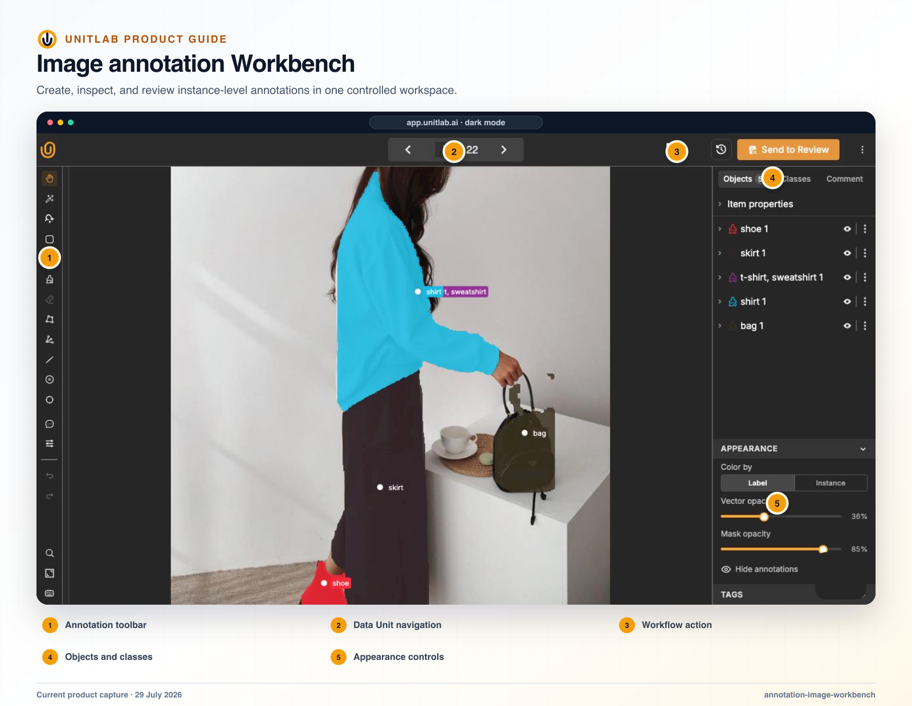


**Who this blueprint is for:** Agriculture AI, phenotyping, crop, livestock, robotics, and quality teams. **Outcome:** Preserve field and organism context while producing reproducible object, count, condition, and tracking labels.


## Decision to make

State the operational or model decision in one sentence. Then list the minimum evidence, temporal or spatial context, allowed uncertainty, and downstream representation required to make that decision consistently. Do not begin with a tool list; begin with the decision contract.

## Before you begin

- A named business or model decision that the data program must support.
- Representative normal, difficult, ambiguous, invalid, and failure examples.
- Named owners for source data, labeling policy, annotation operations, review, and downstream acceptance.
- A downstream consumer that can validate one sample release.

## Operating blueprint

~~~mermaid
flowchart LR
  A["Field observations"]
  B["Grouped views"]
  C["Identity + condition"]
  D["Review + cohort QA"]
  E["Model-ready release"]
  A --> B
  B --> C
  C --> D
  D --> E
~~~

## Implementation



### 1. Define the plant, row, tree, animal, plot, harvest event, or observation window as the unit of work


### 2. Group related angles or timepoints and retain field, device, season, treatment, and weather metadata


### 3. Use embedding exploration and filters to include density, lighting, occlusion, growth stage, and rare conditions


### 4. Design classes for identity and geometry and properties for maturity, health, visibility, confidence, and condition


### 5. Configure Multiview and video policy for overlap, repeated objects, occlusion, re-entry, and double-count prevention


### 6. Calibrate annotators and reviewers on dense scenes and incomplete views


### 7. Publish dataset versions that preserve split-level group integrity


### 8. Validate counts, identities, geometry, properties, and group membership in the downstream model pipeline



## Current Unitlab capabilities

**Problem:** A frame contains many similar cherries, and the same scene is captured from two angles.

**Unitlab pattern:**

1. Group the two camera views.
2. Annotate one trusted seed object.
3. Run Find Similar.
4. Adjust the confidence threshold and inspect candidates.
5. Accept only valid suggestions.
6. Continue tracking across frames if the data is video.

This workflow combines multiview context with seed-based assistance, reducing repetitive drawing while keeping acceptance under annotator control.

## Validation gates

- [ ] The unit of work preserves every modality and viewpoint required for the decision.
- [ ] Instructions, ontology, workflow, roles, and review criteria express one consistent policy.
- [ ] Normal, hard, ambiguous, invalid, rejected, and failed cases have an explicit route and owner.
- [ ] AI-assisted output is reviewed under the same semantic and workflow controls as manual work.
- [ ] A named release is reproducible and accepted by the downstream consumer.

## Risks and controls

| Risk | Control |
|---|---|
| Context is split across unrelated tasks | Use Data Groups and a custom layout; validate incomplete and ambiguous group behavior before attachment. |
| Operators invent different policies | Align Instructions, ontology validation, calibration examples, and reviewer decisions before scale. |
| Throughput hides systematic error | Inspect cohorts, issue categories, rejection patterns, and model failures rather than relying on aggregate completion. |
| A configuration change alters active work | Pilot the change on a controlled sample, record impact, and validate downstream schema before rollout. |
| Delivery cannot be reproduced | Pin dataset versions and retain ontology, workflow, model, format, split, exclusion, and validation records with the release. |

## Production evidence

Retain the workspace and project IDs; source scope; Data Group rule and layout version; dataset version; Instructions owner; ontology version; workflow stages and routes; role assignments; model and endpoint versions; calibration cohort; quality findings; unresolved exceptions; release ID and format; downstream validation result; approval owner; and the date or event that triggers the next review. Never place credentials, signed download URLs, cloud secrets, or regulated source data in this record.

## Product view

*Image annotation combines geometry, object properties, and review actions for field and crop programs.*

*Embedding exploration supports representative sampling and rare-condition discovery before human verification.*

