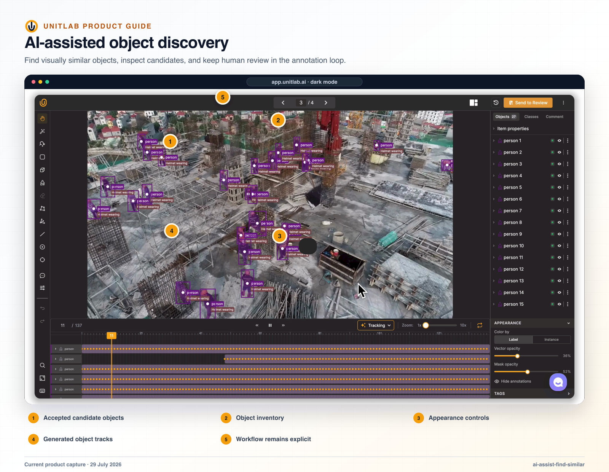


**Who this blueprint is for:** Solution architects, program owners, project managers, quality leads, and downstream data consumers. **Outcome:** Use the smallest appropriate assist while keeping semantic decisions, correction, review, and stage transitions human-accountable.


## Decision to make

State the operational or model decision in one sentence. Then list the minimum evidence, temporal or spatial context, allowed uncertainty, and downstream representation required to make that decision consistently. Do not begin with a tool list; begin with the decision contract.

## Before you begin

- A named business or model decision that the data program must support.
- Representative normal, difficult, ambiguous, invalid, and failure examples.
- Named owners for source data, labeling policy, annotation operations, review, and downstream acceptance.
- A downstream consumer that can validate one sample release.

## Operating blueprint

~~~mermaid
flowchart LR
  A["Policy"]
  B["Model proposal"]
  C["Human correction"]
  D["Workflow review"]
  E["Feedback evidence"]
  A --> B
  B --> C
  C --> D
  D --> E
~~~

## Implementation



### 1. Define which decisions a model may propose and which a person must make


### 2. Choose Magic Touch, Detect all objects, Find Similar, tracking, interpolation, captioning, batch automation, or a Model stage for the intended output


### 3. Pin the model, endpoint, mapping, ontology, source domain, and acceptance policy


### 4. Run the assist on a representative pilot and correct proposals in the native editor


### 5. Route accepted, rejected, empty, failed, timed-out, and ambiguous output explicitly


### 6. Measure correction and systematic error by class, source domain, operation, and model version


### 7. Expand volume only after the human-reviewed output and failure paths are stable



## Current Unitlab capabilities

Unitlab combines local assistance inside the workbench with Model stages inside workflows. Assisted results remain proposals until they are reviewed and accepted through the annotation and quality process.

## Magic Touch

Magic Touch is available in image and video toolbars as an interactive mask-oriented tool. When no compatible class is selected, it opens a Create Class dialog configured for a Mask class, with name, color, and numeric hotkey fields.

The correct production loop is:

1. Select the target mask class.
2. Guide the proposal on a representative object.
3. Inspect boundaries, holes, thin structures, and occlusion.
4. Correct with manual tools.
5. Review the final mask under the same policy as a fully manual label.

## Detect all objects

A class-aware auto-labeling panel contains:

- current class;
- prompt textbox;
- prompt initially populated from the class name;
- reset prompt to class name;
- Detect all objects.

Detect all objects provides prompt-based, class-aware detection within the current image or video frame.

Detect all objects is available on images and individual video frames. It uses shortcut **S**, opens a **Create annotations** popup with a SAM 3 badge, and requires an active class with bounding-box, polygon, mask, or cuboid geometry. The prompt defaults to the class name and accepts up to 300 characters. Each call is scoped to the current image or current frame, can return up to a configured maximum number of candidates, and consumes one AI-inference quota unit when successful.

Annotators review proposed objects before accepting them. Prompt changes can alter the candidate distribution even when the ontology class name remains the same, so teams can standardize prompts in their labeling instructions.

## Find Similar

Find Similar is a contextual header action, not a drawing tool. It becomes available when the selected object is a box, polygon, or mask. It searches the current image or current video frame, exposes a confidence threshold, removes strong overlaps with existing annotations, and holds new predictions for review before commitment. It does not search across the full dataset and does not consume AI-inference quota.

Find Similar can return multiple candidates at the selected confidence threshold, with **Clear** and **Accept all** actions available. Seed quality, visual repetition, clutter, scale, and threshold affect the result, so operators review each candidate set in context before acceptance.

## Auto-Tracking and interpolation

Auto-Tracking predicts later frames with machine learning; interpolation fills geometry between keyframes. Both results remain visible on the timeline for human review and correction.

## Magic Crop

Magic Crop runs model-assisted labeling inside a user-selected crop region. It is useful when the relevant objects occupy one part of a larger surface and whole-image detection would create unnecessary proposals. Each call uses AI-inference quota and still requires review before acceptance.

## AI captioning

AI-assisted captioning can propose text for the current item. The proposal should be reviewed against the item-property or captioning ontology rather than treated as an automatically accepted description.

## Batch auto-annotation

Unitlab supports batch auto-annotation for model-assisted labeling. Batch jobs apply model assistance across a selected data scope, while human review remains part of the annotation and workflow process.

## Model stages

A Model stage can be placed between human stages in a workflow. Model output can move forward to annotation or review, while rejected outcomes return through the configured correction route. Inference behavior follows the connected model’s input, output, and class mapping configuration.

- **Model → Annotate → Review:** a model proposes labels, an annotator corrects them, and a reviewer verifies the result.
- **Annotate with local assistance → Review:** Magic Touch, prompt detection, Find Similar, or tracking helps the annotator within the task.
- **Model → Review with rejection to annotation:** high-confidence output moves directly to review; rejected work returns to a human correction stage.
- **Annotate → Review → specialist Review:** ambiguous or high-risk cases move to a second Review stage configured for specialists.

## Validation gates

- [ ] The unit of work preserves every modality and viewpoint required for the decision.
- [ ] Instructions, ontology, workflow, roles, and review criteria express one consistent policy.
- [ ] Normal, hard, ambiguous, invalid, rejected, and failed cases have an explicit route and owner.
- [ ] AI-assisted output is reviewed under the same semantic and workflow controls as manual work.
- [ ] A named release is reproducible and accepted by the downstream consumer.

## Risks and controls

| Risk | Control |
|---|---|
| Context is split across unrelated tasks | Use Data Groups and a custom layout; validate incomplete and ambiguous group behavior before attachment. |
| Operators invent different policies | Align Instructions, ontology validation, calibration examples, and reviewer decisions before scale. |
| Throughput hides systematic error | Inspect cohorts, issue categories, rejection patterns, and model failures rather than relying on aggregate completion. |
| A configuration change alters active work | Pilot the change on a controlled sample, record impact, and validate downstream schema before rollout. |
| Delivery cannot be reproduced | Pin dataset versions and retain ontology, workflow, model, format, split, exclusion, and validation records with the release. |

## Production evidence

Retain the workspace and project IDs; source scope; Data Group rule and layout version; dataset version; Instructions owner; ontology version; workflow stages and routes; role assignments; model and endpoint versions; calibration cohort; quality findings; unresolved exceptions; release ID and format; downstream validation result; approval owner; and the date or event that triggers the next review. Never place credentials, signed download URLs, cloud secrets, or regulated source data in this record.

## Product view

*Model-assisted candidates accelerate discovery while final semantic acceptance remains human-accountable.*

