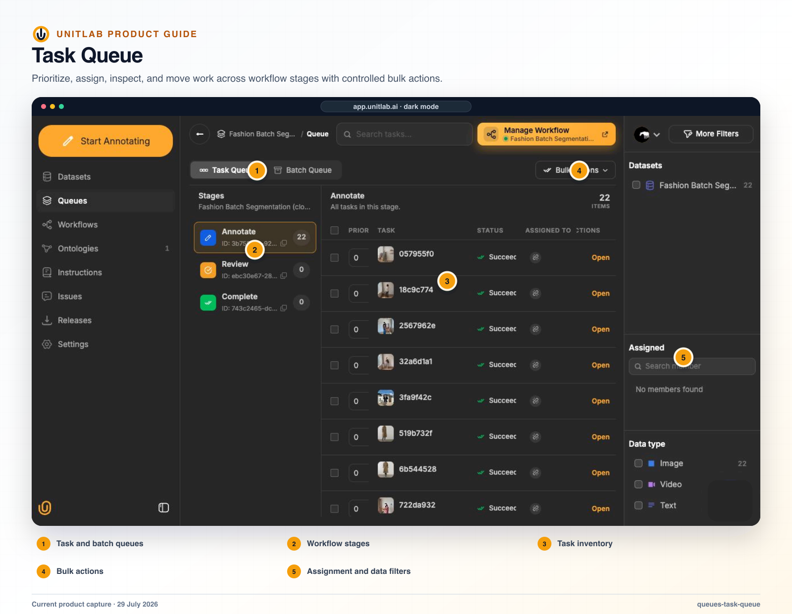


**Who this blueprint is for:** Solution architects, program owners, project managers, quality leads, and downstream data consumers. **Outcome:** Operate quality as a connected control system rather than a final sample or one aggregate score.


## Decision to make

State the operational or model decision in one sentence. Then list the minimum evidence, temporal or spatial context, allowed uncertainty, and downstream representation required to make that decision consistently. Do not begin with a tool list; begin with the decision contract.

## Before you begin

- A named business or model decision that the data program must support.
- Representative normal, difficult, ambiguous, invalid, and failure examples.
- Named owners for source data, labeling policy, annotation operations, review, and downstream acceptance.
- A downstream consumer that can validate one sample release.

## Operating blueprint

~~~mermaid
flowchart LR
  A["Policy"]
  B["Calibration"]
  C["Cohort detection"]
  D["Owned correction"]
  E["Release evidence"]
  A --> B
  B --> C
  C --> D
  D --> E
~~~

## Implementation



### 1. Assign accountable owners for Instructions, ontology, reviewer calibration, issues, escalation, models, and release acceptance


### 2. Write inclusion, exclusion, ambiguity, invalid-data, geometry, attribute, and acceptance policy


### 3. Create a calibration set with normal, difficult, borderline, invalid, and known failure examples


### 4. Use workflow routes and queues for ownership; use comments for context and Issues for owned follow-through


### 5. Inspect cohorts for systematic patterns by source, class, operator, stage, condition, and model version


### 6. Correct Instructions, ontology, workflow, training, or integration when the system—not only one item—is wrong


### 7. Retest the affected cohort and retain approval evidence with the release



## Current Unitlab capabilities

Quality is distributed across several product surfaces rather than contained in one “QA” button.

## Project instructions

Instructions can contain:

- rich text/description;
- external URL;
- file attachment;
- PDF upload;
- PPT upload.

Instructions should be the current operational standard an annotator can consult while working. They should include definitions, decision rules, hard examples, counterexamples, uncertainty policy, and escalation steps.

## Comments

Comments live inside the annotation workbench and are appropriate for context attached to a specific item or label. They should not become the only place where a repeated rule is documented; recurring decisions belong in the instructions or ontology.

## Issues

Project issues include content, status, responsible member, creator, and created date. Issue links can return the user to the exact annotation context and load the correct editor for that item’s data family. An issue is appropriate when a problem requires ownership and follow-through beyond one annotation comment.

## Review and specialist escalation

Review is an explicit workflow decision. Specialist escalation can be modeled as another Review stage with a restricted eligible-member list. A useful closed loop is:

```text
Annotation or policy error
    ↓
Reviewer correction or rejection
    ↓
Issue categorized
    ↓
Ontology, instruction, model, or assignment change
    ↓
New tasks measured for recurrence
```

The most important quality metric is not raw labeling speed. It is accepted, usable units per hour after correction, rework, and downstream failures are included.

## Notifications

Workflow-aware notifications include stage-ready, task-assigned, task-claimed, rework, comment, mention, automation, and conflict events. The notification list supports bulk actions. Rework notifications are particularly important because they connect a reviewer’s rejection to the annotator who must correct it.

## Statistics and team visibility

Statistics appear at project and member levels. Current surfaces include:

- project overview charts;
- monthly progress;
- daily time series;
- overall progress;
- average time per item;
- total working time;
- issue counts;
- annotator and reviewer breakdowns;
- member heatmaps and summaries;
- workspace member statistics pages.

Some statistics and premium role experiences depend on the workspace subscription. Statistics should be interpreted with workflow context—for example, faster annotation can coexist with higher reviewer rejection and should not be reported as improved productivity in isolation.

## Validation gates

- [ ] The unit of work preserves every modality and viewpoint required for the decision.
- [ ] Instructions, ontology, workflow, roles, and review criteria express one consistent policy.
- [ ] Normal, hard, ambiguous, invalid, rejected, and failed cases have an explicit route and owner.
- [ ] AI-assisted output is reviewed under the same semantic and workflow controls as manual work.
- [ ] A named release is reproducible and accepted by the downstream consumer.

## Risks and controls

| Risk | Control |
|---|---|
| Context is split across unrelated tasks | Use Data Groups and a custom layout; validate incomplete and ambiguous group behavior before attachment. |
| Operators invent different policies | Align Instructions, ontology validation, calibration examples, and reviewer decisions before scale. |
| Throughput hides systematic error | Inspect cohorts, issue categories, rejection patterns, and model failures rather than relying on aggregate completion. |
| A configuration change alters active work | Pilot the change on a controlled sample, record impact, and validate downstream schema before rollout. |
| Delivery cannot be reproduced | Pin dataset versions and retain ontology, workflow, model, format, split, exclusion, and validation records with the release. |

## Production evidence

Retain the workspace and project IDs; source scope; Data Group rule and layout version; dataset version; Instructions owner; ontology version; workflow stages and routes; role assignments; model and endpoint versions; calibration cohort; quality findings; unresolved exceptions; release ID and format; downstream validation result; approval owner; and the date or event that triggers the next review. Never place credentials, signed download URLs, cloud secrets, or regulated source data in this record.

## Product view



*Operational queues turn quality policy into assigned, observable, and reviewable work.*

